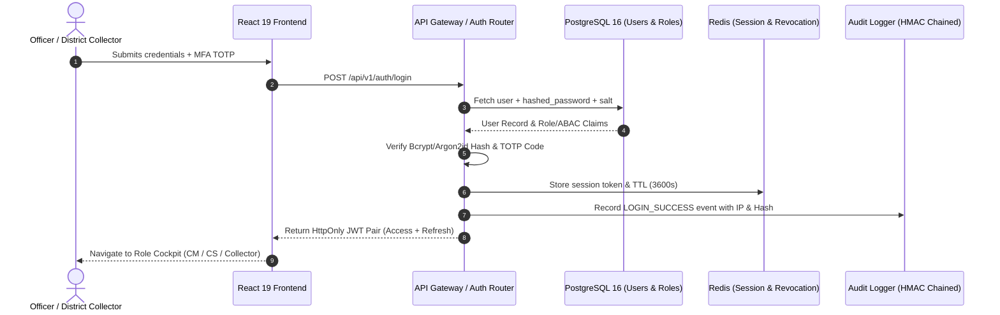

# VETTRI TN AI OS — Authentication & Access Control Specification

> **System:** VETTRI TN AI OS (*வெற்றி*)  
> **Security Standards:** OAuth 2.0 / OIDC / PKCE / Zero Trust / DPDP Act Compliant  
> **Version:** 1.0.0

---

## 1. Authentication Lifecycle & Protocol Flow

---

## 2. RBAC & ABAC Matrix

| Role | Read Permissions | Action Directives | Scope Restriction |
| :--- | :--- | :--- | :--- |
| **CHIEF_MINISTER** | All 38 districts, all ministries, all intelligence alerts | Issue CM Directives, convene emergency cabinets | State-wide (Unrestricted) |
| **CHIEF_SECRETARY** | All departmental operations, project delays, officer reviews | Issue inter-dept orders, set inquiry commissions | State-wide (Administrative) |
| **MINISTER** | Assigned Ministry portfolios & associated schemes | Review departmental KPIs, draft legislative answers | Ministry Scope |
| **DEPARTMENT_SECRETARY**| Assigned Department schemes, budgets, tenders, field officers | Approve tenders, allocate funds, order inspections | Department Scope |
| **DISTRICT_COLLECTOR** | All taluks, PHCs, schools, grievances within assigned district | Dispatch district teams, issue section orders | Single District Scope |

---

## 3. Session Hardening & Token Security
- **Short-Lived Access Tokens:** 15-minute expiration; renewed seamlessly via rotating refresh tokens.
- **Biometric & FIDO2 Support:** Ready integration for WebAuthn security keys for Chief Minister and Cabinet terminals.
- **Immediate Session Revocation:** Redis blacklist allows instant revocation of any compromised account token state-wide within 5 milliseconds.
