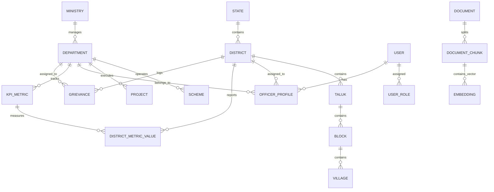

# VETTRI TN AI OS — Database & Data Platform Architecture

> **System:** VETTRI TN AI OS (*வெற்றி*)  
> **Database Engine:** PostgreSQL 16 Enterprise with pgvector 0.7+  
> **Version:** 1.0.0

---

## 1. Relational Entity Relationship (ER) Model



---

## 2. Core SQL Schema Definitions

### 2.1 Administrative Hierarchy & Governance Structure

```sql
-- Enable necessary extensions
CREATE EXTENSION IF NOT EXISTS "uuid-ossp";
CREATE EXTENSION IF NOT EXISTS "pgcrypto";
CREATE EXTENSION IF NOT EXISTS "vector";

-- 38 Districts of Tamil Nadu
CREATE TABLE districts (
    id UUID PRIMARY KEY DEFAULT gen_random_uuid(),
    code VARCHAR(10) UNIQUE NOT NULL,       -- e.g. 'CHE', 'CBE', 'MDU'
    name_en VARCHAR(100) NOT NULL,          -- e.g. 'Coimbatore'
    name_ta VARCHAR(100) NOT NULL,          -- e.g. 'கோயம்புத்தூர்'
    headquarters_en VARCHAR(100) NOT NULL,
    headquarters_ta VARCHAR(100) NOT NULL,
    geo_boundary JSONB,                     -- GeoJSON MultiPolygon boundary
    latitude NUMERIC(10, 6) NOT NULL,
    longitude NUMERIC(10, 6) NOT NULL,
    population BIGINT NOT NULL,
    area_sq_km NUMERIC(10, 2) NOT NULL,
    is_active BOOLEAN DEFAULT TRUE,
    created_at TIMESTAMPTZ DEFAULT CURRENT_TIMESTAMP,
    updated_at TIMESTAMPTZ DEFAULT CURRENT_TIMESTAMP
);

-- Taluks within Districts
CREATE TABLE taluks (
    id UUID PRIMARY KEY DEFAULT gen_random_uuid(),
    district_id UUID NOT NULL REFERENCES districts(id) ON DELETE CASCADE,
    code VARCHAR(20) UNIQUE NOT NULL,
    name_en VARCHAR(100) NOT NULL,
    name_ta VARCHAR(100) NOT NULL,
    geo_boundary JSONB,
    created_at TIMESTAMPTZ DEFAULT CURRENT_TIMESTAMP
);

-- Ministries & Departments
CREATE TABLE ministries (
    id UUID PRIMARY KEY DEFAULT gen_random_uuid(),
    code VARCHAR(20) UNIQUE NOT NULL,       -- e.g. 'MIN_FIN', 'MIN_HLT'
    name_en VARCHAR(150) NOT NULL,
    name_ta VARCHAR(150) NOT NULL,
    minister_name_en VARCHAR(150),
    minister_name_ta VARCHAR(150),
    created_at TIMESTAMPTZ DEFAULT CURRENT_TIMESTAMP
);

CREATE TABLE departments (
    id UUID PRIMARY KEY DEFAULT gen_random_uuid(),
    ministry_id UUID NOT NULL REFERENCES ministries(id) ON DELETE RESTRICT,
    code VARCHAR(30) UNIQUE NOT NULL,       -- e.g. 'DEPT_COMM_TAX', 'DEPT_TNMSC'
    name_en VARCHAR(150) NOT NULL,
    name_ta VARCHAR(150) NOT NULL,
    secretary_name_en VARCHAR(150),
    secretary_name_ta VARCHAR(150),
    created_at TIMESTAMPTZ DEFAULT CURRENT_TIMESTAMP
);
```

### 2.2 Users, Roles & Security Access Control

```sql
CREATE TYPE user_role_enum AS ENUM (
    'CHIEF_MINISTER',
    'CHIEF_SECRETARY',
    'MINISTER',
    'DEPARTMENT_SECRETARY',
    'DISTRICT_COLLECTOR',
    'COMMISSIONER',
    'TALUK_OFFICER',
    'ANALYST',
    'SYSTEM_ADMIN'
);

CREATE TABLE users (
    id UUID PRIMARY KEY DEFAULT gen_random_uuid(),
    email VARCHAR(255) UNIQUE NOT NULL,
    phone VARCHAR(20) UNIQUE NOT NULL,
    hashed_password VARCHAR(255) NOT NULL,
    full_name_en VARCHAR(150) NOT NULL,
    full_name_ta VARCHAR(150),
    role user_role_enum NOT NULL,
    is_active BOOLEAN DEFAULT TRUE,
    is_mfa_enabled BOOLEAN DEFAULT TRUE,
    mfa_secret VARCHAR(64),
    last_login_at TIMESTAMPTZ,
    created_at TIMESTAMPTZ DEFAULT CURRENT_TIMESTAMP,
    updated_at TIMESTAMPTZ DEFAULT CURRENT_TIMESTAMP
);

CREATE TABLE officer_profiles (
    id UUID PRIMARY KEY DEFAULT gen_random_uuid(),
    user_id UUID UNIQUE NOT NULL REFERENCES users(id) ON DELETE CASCADE,
    designation VARCHAR(150) NOT NULL,
    department_id UUID REFERENCES departments(id),
    district_id UUID REFERENCES districts(id),
    taluk_id UUID REFERENCES taluks(id),
    cadre VARCHAR(50),                     -- e.g. 'IAS', 'IPS', 'TNCS'
    batch_year INT,
    created_at TIMESTAMPTZ DEFAULT CURRENT_TIMESTAMP
);
```

### 2.3 Real-Time Telemetry & Metric Storage

```sql
CREATE TABLE kpi_metrics (
    id UUID PRIMARY KEY DEFAULT gen_random_uuid(),
    department_id UUID NOT NULL REFERENCES departments(id),
    code VARCHAR(50) UNIQUE NOT NULL,       -- e.g. 'REV_GST_COLLECTION_CR'
    name_en VARCHAR(150) NOT NULL,
    name_ta VARCHAR(150) NOT NULL,
    unit VARCHAR(30) NOT NULL,              -- 'Crores', 'Percentage', 'Count'
    frequency VARCHAR(20) NOT NULL,         -- 'HOURLY', 'DAILY', 'MONTHLY'
    target_value NUMERIC(18, 4),
    critical_threshold_low NUMERIC(18, 4),
    critical_threshold_high NUMERIC(18, 4),
    created_at TIMESTAMPTZ DEFAULT CURRENT_TIMESTAMP
);

CREATE TABLE district_metric_values (
    id UUID PRIMARY KEY DEFAULT gen_random_uuid(),
    kpi_metric_id UUID NOT NULL REFERENCES kpi_metrics(id) ON DELETE CASCADE,
    district_id UUID NOT NULL REFERENCES districts(id) ON DELETE CASCADE,
    recorded_at TIMESTAMPTZ NOT NULL,
    val NUMERIC(18, 4) NOT NULL,
    target NUMERIC(18, 4),
    anomaly_score NUMERIC(5, 4) DEFAULT 0.0, -- 0.0 to 1.0 (auto-computed by ML)
    metadata JSONB,
    created_at TIMESTAMPTZ DEFAULT CURRENT_TIMESTAMP
);

CREATE INDEX idx_dist_metrics_timestamp ON district_metric_values(district_id, recorded_at DESC);
```

### 2.4 Vector Database & Document Knowledge Graph (`pgvector`)

```sql
CREATE TABLE documents (
    id UUID PRIMARY KEY DEFAULT gen_random_uuid(),
    title VARCHAR(255) NOT NULL,
    doc_type VARCHAR(50) NOT NULL,          -- 'GO_ORDER', 'BUDGET_DOC', 'AUDIT_REPORT'
    source_department_id UUID REFERENCES departments(id),
    file_path VARCHAR(500) NOT NULL,
    published_date DATE NOT NULL,
    created_at TIMESTAMPTZ DEFAULT CURRENT_TIMESTAMP
);

CREATE TABLE document_chunks (
    id UUID PRIMARY KEY DEFAULT gen_random_uuid(),
    document_id UUID NOT NULL REFERENCES documents(id) ON DELETE CASCADE,
    chunk_index INT NOT NULL,
    content TEXT NOT NULL,
    content_ta TEXT,
    metadata JSONB,
    embedding vector(1536),                 -- 1536-dim vector for embeddings
    tsv_content tsvector GENERATED ALWAYS AS (to_tsvector('english', content)) STORED,
    created_at TIMESTAMPTZ DEFAULT CURRENT_TIMESTAMP
);

-- Create HNSW Index for sub-millisecond semantic search
CREATE INDEX idx_doc_chunk_embedding ON document_chunks USING hnsw (embedding vector_cosine_ops);
CREATE INDEX idx_doc_chunk_tsv ON document_chunks USING gin (tsv_content);
```

### 2.5 Immutable Audit Log

```sql
CREATE TABLE audit_logs (
    id UUID PRIMARY KEY DEFAULT gen_random_uuid(),
    user_id UUID REFERENCES users(id),
    action VARCHAR(100) NOT NULL,
    resource_type VARCHAR(50) NOT NULL,
    resource_id VARCHAR(100),
    ip_address INET,
    user_agent TEXT,
    payload JSONB,
    previous_hash VARCHAR(64),
    current_hash VARCHAR(64) NOT NULL,      -- Cryptographically chained SHA-256
    created_at TIMESTAMPTZ DEFAULT CURRENT_TIMESTAMP
);

CREATE INDEX idx_audit_created ON audit_logs(created_at DESC);
```
