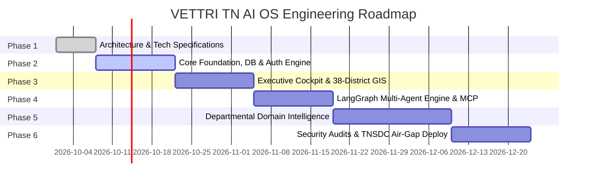

# VETTRI TN AI OS — Development Roadmap & Milestones

> **System:** VETTRI TN AI OS (*வெற்றி*)  
> **Lifecycle:** 6-Phase Enterprise Delivery Model  
> **Target:** Government of Tamil Nadu  
> **Version:** 1.0.0

---

## 1. Master Phased Delivery Plan

---

## 2. Milestone Deliverables

| Phase | Milestone Name | Key Deliverables & Validation Criteria |
| :--- | :--- | :--- |
| **Phase 1** | **Architecture & Blueprints** | Full specification markdown library, database schemas, OpenAPI contracts, and monorepo scaffolding. |
| **Phase 2** | **Foundation & Security Core** | PostgreSQL 16 + pgvector, FastAPI async base, JWT + RBAC authorization, Master Data APIs (38 districts, taluks, departments). |
| **Phase 3** | **Executive Command Center** | React 19 glassmorphic dashboard, Hon'ble Chief Minister State Health Index, MapLibre GL 38-district GIS map, TanStack Query integration. |
| **Phase 4** | **Multi-Agent AI Platform** | LangGraph CM Copilot, MCP tool mesh, Hybrid RAG pipeline with Government Orders (GOs), bilingual Tamil/English response engine. |
| **Phase 5** | **Departmental Modules** | Complete full-stack implementations for Revenue, Health, Police, Agriculture, and Fraud Detection modules. |
| **Phase 6** | **Hardening & Sovereign Deploy** | Synthetic TN simulation dataset, end-to-end Cypress/Pytest suites, Docker & Kubernetes Helm charts for State Data Center. |
