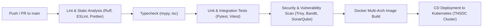

# VETTRI TN AI OS — CI/CD Pipeline & GitHub Actions Specification

> **System:** VETTRI TN AI OS (*வெற்றி*)  
> **CI/CD Platform:** GitHub Actions & Self-Hosted TNSDC Runners  
> **Version:** 1.0.0

---

## 1. Automated Quality Gate Pipeline

---

## 2. Core GitHub Workflows

### 2.1 Backend CI (`.github/workflows/ci-backend.yml`)
- Triggers on PR/push to `backend/**` or `agents/**`.
- Sets up Python 3.12, caches UV/Pip dependencies.
- Runs `ruff check .`, `mypy app`, and `pytest --cov=app tests/`.

### 2.2 Frontend CI (`.github/workflows/ci-frontend.yml`)
- Triggers on PR/push to `frontend/**`.
- Sets up Node.js 22, runs `pnpm lint`, `pnpm type-check`, and `pnpm test`.
- Builds production Vite bundle and tests asset chunk limits (<500kb).

### 2.3 Automated Agent Benchmarks (`.github/workflows/ci-agents.yml`)
- Executes test dataset evaluation on LangGraph agent graphs to measure hallucination rates and grounding fidelity.
