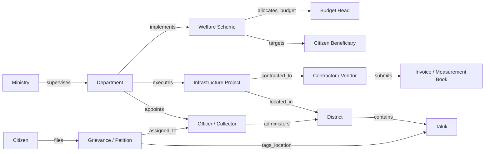

# VETTRI TN AI OS — State Governance Knowledge Graph

> **System:** VETTRI TN AI OS (*வெற்றி*)  
> **Component:** Relational-Graph Hybrid Ontology & GraphRAG Engine  
> **Version:** 1.0.0

---

## 1. Graph Ontology & Node-Edge Taxonomy

The State Knowledge Graph maps every interconnected entity across the Tamil Nadu administrative apparatus to trace fund flows, dependencies, delays, and causality.

---

## 2. Graph Node Types & Properties

1. **`Ministry`**: `id`, `code`, `name_en`, `name_ta`, `cabinet_rank`.
2. **`Department`**: `id`, `code`, `name_en`, `name_ta`, `secretary_ias_id`.
3. **`District`**: `id`, `code`, `name_en`, `name_ta`, `collector_ias_id`, `population`, `zone`.
4. **`Scheme`**: `id`, `name_en`, `name_ta`, `outlay_cr`, `beneficiary_type`, `launch_year`.
5. **`Project`**: `id`, `name`, `estimated_cost_cr`, `revised_cost_cr`, `sanctioned_date`, `deadline`, `contractor_id`.
6. **`Grievance`**: `id`, `petition_no`, `source` (*Mudhalvarin Mugavari*), `category`, `status`, `sla_days_remaining`.

---

## 3. High-Value Graph Traversal Queries (GraphRAG)

### 3.1 Contagion & Delay Impact Analysis
- **Query:** *"If the SIPCOT industrial water supply project in Ranipet is delayed by 6 months, which specific industrial clusters, MSME export commitments, and employment targets are impacted?"*
- **Traversal:** `Project(SIPCOT Water)` $\rightarrow$ `SUPPLIES_TO` $\rightarrow$ `IndustrialPark` $\rightarrow$ `HOSTS` $\rightarrow$ `Enterprise[]` $\rightarrow$ `HAS_KPI` $\rightarrow$ `EmploymentTarget`.

### 3.2 Fund Flow & Anti-Collusion Traversal
- **Query:** *"Identify contractors bidding on PWD road projects who share registered directors, bank accounts, or physical addresses with existing blacklisted entities."*
- **Traversal:** `TenderBid` $\rightarrow$ `SUBMITTED_BY` $\rightarrow$ `Contractor` $\rightarrow$ `HAS_DIRECTOR` $\rightarrow$ `Person` $\leftarrow$ `HAS_DIRECTOR` $\leftarrow$ `BlacklistedContractor`.
