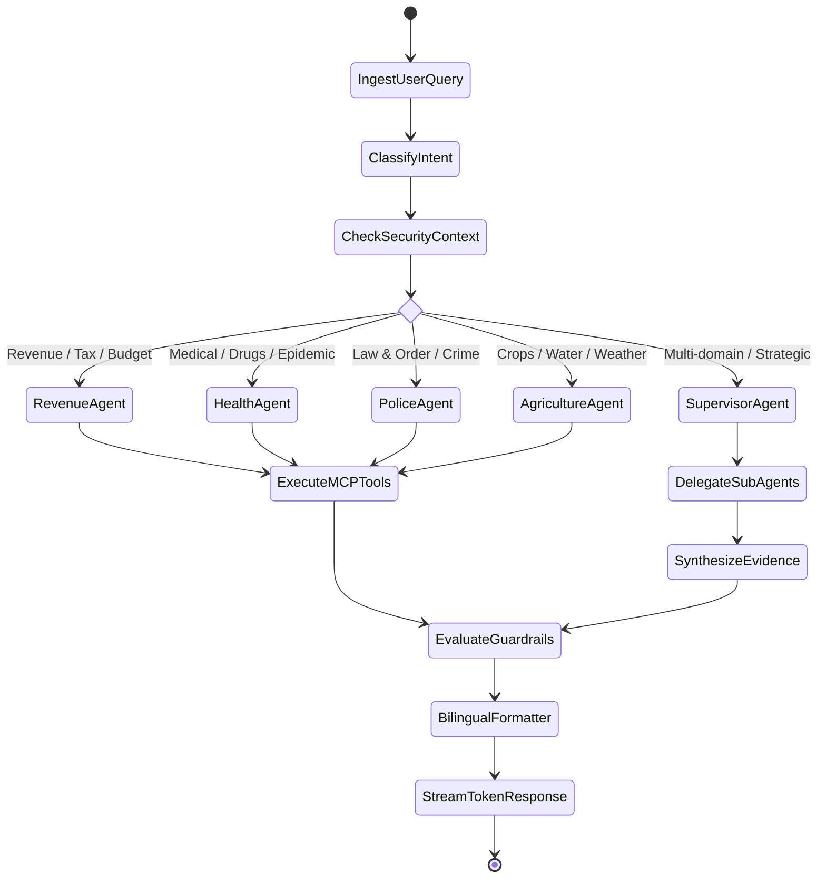

# VETTRI TN AI OS — LangGraph Multi-Agent Architecture

> **System:** VETTRI TN AI OS (*வெற்றி*)  
> **Component:** Multi-Agent StateGraph & Workflow Definitions  
> **Framework:** LangGraph v0.2+ / Python 3.12+  
> **Version:** 1.0.0

---

## 1. Supervisor-Worker LangGraph State Architecture



---

## 2. Core LangGraph State Schema (`AgentState`)

```python
from typing import Annotated, Sequence, TypedDict, Literal, Optional, Any
from langchain_core.messages import BaseMessage
import operator

class AgentState(TypedDict):
    """Immutable state passed between LangGraph nodes during execution."""
    
    # Message history with automatic appending
    messages: Annotated[Sequence[BaseMessage], operator.add]
    
    # User Context & Authorization
    user_id: str
    user_role: str                   # 'CHIEF_MINISTER', 'CHIEF_SECRETARY', etc.
    assigned_district: Optional[str] # e.g. 'CHE', 'CBE'
    language_pref: Literal['en', 'ta']
    
    # Query Analysis
    intent: str
    domain_targets: list[str]        # ['revenue', 'health', 'police']
    confidence_score: float
    
    # Retrieved Ground Truth
    sql_results: list[dict[str, Any]]
    rag_citations: list[dict[str, Any]]
    gis_features: list[dict[str, Any]]
    
    # Agent Inter-Communication
    active_agent: str
    pending_approvals: list[dict[str, Any]]
    
    # Output Synthesis
    final_summary_en: str
    final_summary_ta: str
    actionable_recommendations: list[dict[str, Any]]
    guardrail_status: Literal['PASSED', 'REJECTED', 'FLAGGED']
```

---

## 3. Node Definitions & Execution Logic

### 3.1 Supervisor Node (`cm_supervisor`)
- Inspects `messages[-1]`.
- Determines if the query spans multiple departments (e.g., *"How is the flood in Tuticorin affecting road transport and relief fund disbursement?"*).
- Delegates sub-tasks to `DisasterAgent`, `TransportAgent`, and `FinanceAgent` in parallel.
- Aggregates sub-agent findings into an executive briefing.

### 3.2 Domain Worker Nodes
- Specialized workers armed with domain-specific system prompts, few-shot prompt libraries, and constrained MCP tool registries.
- Execute tools deterministically, returning structured Pydantic models.

### 3.3 Guardrail & Fact-Check Node (`guardrail_verifier`)
- Compares numerical claims in generated text against raw `sql_results`.
- If a discrepancy > 0.01% is detected, intercepts the response and re-prompts the worker with the error context.
- Generates bilingual Tamil translation matching standard government protocol terminology.
