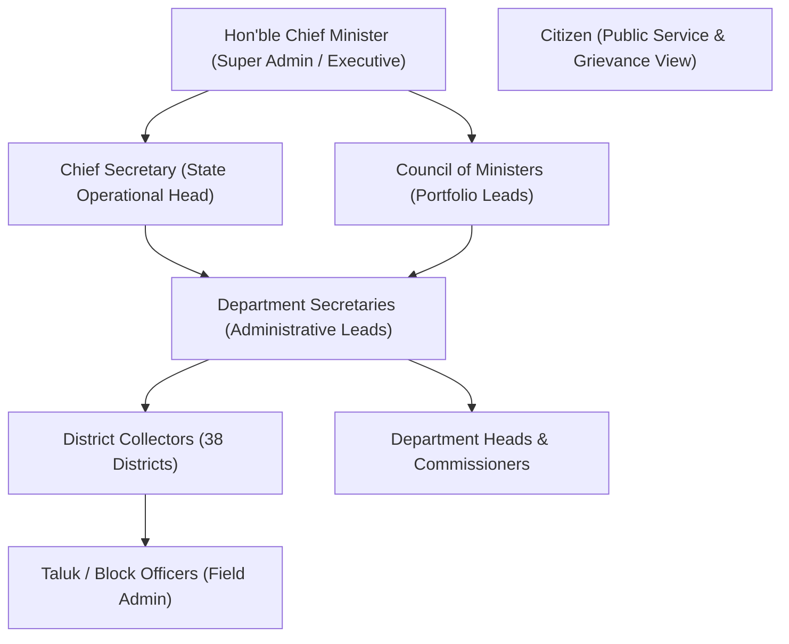

# VETTRI TN AI OS — Product Requirements Document (PRD)

> **VETTRI (*வெற்றி*) — Victory in Tamil**  
> **Target:** Government of Tamil Nadu  
> **Classification:** Confidential — Official Government Technology Specification  
> **Document Version:** 1.0.0 (Production Release Architecture)

---

## 1. Executive Summary & Vision

VETTRI TN AI OS is the state-wide **Artificial Intelligence Operating System for Governance, Intelligence, and Decision Support** designed for the Hon'ble Chief Minister, Chief Secretary, Council of Ministers, Department Secretaries, and 38 District Collectors of Tamil Nadu.

It transforms governance from fragmented, delayed, retrospective paper/MIS reporting into a **real-time, predictive, autonomous decision support system**.

### 1.1 Core Value Proposition
- **Unified Executive Cockpit:** Single pane of glass for all 38 districts and 35+ departments.
- **Autonomous Multi-Agent Brain:** Proactive AI agents monitoring revenue, health, law & order, agriculture, infrastructure, and citizen grievances 24/7.
- **Evidence-Grounded Intelligence:** Every recommendation is backed by real-time telemetry, geo-tagged field proof, and official Government Orders (GOs).
- **Zero-Latency Escalation:** Automated anomaly detection, fraud detection, and predictive risk scoring before issues turn into crises.

---

## 2. User Personas & Permissions Hierarchy

| Persona | Primary Needs & Workflows | Key Features Accessible |
| :--- | :--- | :--- |
| **Chief Minister** | High-level state health, priority alerts, cross-department decisions, voice-driven AI briefings | CM Copilot, State Scorecard, Priority Intervention Queue, Revenue vs. Outlay |
| **Chief Secretary** | Inter-departmental coordination, project deadline tracking, crisis management, secretary accountability | CS Command Cockpit, Secretary Scorecards, Cross-Ministry Task Routing |
| **Ministers** | Departmental KPI tracking, scheme progress, legislative query prep, budget utilization | Ministry Intelligence, Scheme Progress Dashboard, Legislative Briefing Generator |
| **Department Secretaries** | Operational throughput, vendor performance, resource allocation, policy impact analysis | Department Deep-dive, Field Officer Performance, Scheme Delivery Telemetry |
| **District Collectors** | Taluk-level metrics, grievance resolution speed, law & order, disaster alerts, scheme saturation | 38-District GIS Map, Taluk Scorecards, Grievance Heatmaps, Ration/Health Stockouts |
| **Field Officers** | Task execution, GPS-tagged inspection uploads, grievance status updates | Mobile PWA, Offline sync, Biometric/Geo-fencing evidence capture |

---

## 3. Functional Requirements

### 3.1 Executive Command Center & Decision Support
- **State Health Index (SHI):** Real-time composite score (0-100) calculated across Economic Health, Public Health, Law & Order, Scheme Delivery, and Infrastructure Velocity.
- **Natural Language Chief Minister Copilot:** Bilingual conversational agent (Tamil & English) supporting queries such as:
  - *"Which districts have medicine stockouts exceeding 15%?"*
  - *"Show delayed infrastructure projects above ₹50 Crore in Coimbatore and Madurai."*
  - *"Explain the 8% drop in commercial tax collection in Tirupur district this quarter."*
- **Explainable Recommendations:** Step-by-step reasoning with citations to Government Orders, audit records, and raw telemetry data.

### 3.2 Departmental Intelligence Modules
1. **Finance & Revenue Intelligence:** Commercial taxes, registration fees, excise, mineral revenue, expenditure velocity, budget leakage detection.
2. **Healthcare & Medical Services:** Real-time drug inventory tracking (TNMSC), primary health center doctor attendance, maternal mortality tracking, epidemic early warning.
3. **Police & Public Safety:** Crime trends, traffic safety indices, sensitive area monitoring, pending investigation aging.
4. **Agriculture & Water Resources:** Reservoir storage capacities (Mettur, Bhavanisagar, Vaigai, etc.), groundwater levels, MSP procurement centers, crop loss assessments.
5. **Infrastructure & Projects:** Geo-tagged milestone tracking for roads, bridges, SIPCOT industrial parks, Metro Rail, and rural housing.
6. **Citizen Grievance & Scheme Delivery:** Integrated *Mudhalvarin Mugavari* (CM Helpline) ingestion, auto-classification of petitions, SLA breach alerts.

### 3.3 Multi-Agent AI Orchestration
- Autonomous specialized sub-agents running on LangGraph with Model Context Protocol (MCP) data tool calling.
- Supervisor agent dynamically routing queries and synthesizing cross-domain reports.
- Self-evaluating guardrails preventing hallucinations, toxic outputs, or ungrounded data.

---

## 4. Non-Functional Requirements (NFRs)

### 4.1 Performance & Scalability
- **Sub-second UI latency:** Page load time under 800ms; sub-200ms API response for cached dashboard telemetry.
- **Real-time Streaming:** Server-Sent Events (SSE) and WebSockets for live alerts, agent reasoning token streaming.
- **Concurrent Users:** Designed for 50,000+ concurrent government officials and 1,000,000+ public API queries during emergency broadcasts.

### 4.2 Security, Privacy & Compliance
- **Zero-Trust Architecture:** Strict Role-Based (RBAC) and Attribute-Based Access Control (ABAC).
- **Data Sovereignty:** 100% compliant with Indian Digital Personal Data Protection Act (DPDP Act) and Tamil Nadu State Data Centre (TNSDC) guidelines.
- **Cryptographic Audit Log:** Immutable, tamper-evident action logging for all data access, prompt queries, and executive decisions.
- **Air-Gap Capability:** Ability to run LLM inference fully air-gapped on local high-performance hardware (Ollama / vLLM with Llama 3.3).

### 4.3 Availability & Disaster Recovery
- 99.99% system availability with automated failover across primary (Chennai) and DR (Coimbatore/Madurai) availability zones.
- RPO (Recovery Point Objective) < 1 minute; RTO (Recovery Time Objective) < 5 minutes.

---

## 5. Success Metrics & KPIs
- **Grievance Resolution Velocity:** 40% reduction in average petition closure turnaround time across 38 districts.
- **Budget Burn Precision:** 95%+ alignment between planned quarterly budget allocation and actual verified execution.
- **Early Outbreak Warning:** Minimum 7-day advance anomaly alert for localized seasonal health spikes (Dengue, Leptospirosis).
- **Executive Efficiency:** Zero dependence on manual slide decks or static PDF reports for Chief Minister cabinet review meetings.
