# VETTRI TN AI OS — Retrieval-Augmented Generation (RAG) Architecture

> **System:** VETTRI TN AI OS (*வெற்றி*)  
> **Engine:** Hybrid Dense-Sparse RAG + Re-ranking Pipeline  
> **Vector Engine:** PostgreSQL `pgvector` 0.7+  
> **Version:** 1.0.0

---

## 1. End-to-End RAG Ingestion & Query Pipeline

```mermaid
flowchart TD
    subgraph INGESTION ["Ingestion & Indexing Pipeline"]
        PDF["Government Orders (GOs), Budgets, RTI, Audits"] --> OCR["Tesseract / PaddleOCR (Tamil & English)"]
        OCR --> CHUNK["Semantic & Recursive Chunking (512 tokens + 64 overlap)"]
        CHUNK --> EMBED["Embedding Model (text-embedding-3-large / nomic-embed-text)"]
        EMBED --> DENSE_STORE[("PostgreSQL pgvector (HNSW Index)")]
        CHUNK --> SPARSE_STORE[("PostgreSQL Full-Text Search (GIN BM25)")]
    end

    subgraph RETRIEVAL ["Hybrid Retrieval & Re-ranking"]
        USER_QUERY["Officer / CM Query"] --> QUERY_EXP["Query Expansion & Tamil/English Normalization"]
        QUERY_EXP --> DENSE_SEARCH["Dense Semantic Search (Cosine Sim)"]
        QUERY_EXP --> SPARSE_SEARCH["Sparse Keyword Search (ts_rank)"]
        DENSE_SEARCH --> RRF["Reciprocal Rank Fusion (RRF)"]
        SPARSE_SEARCH --> RRF
        RRF --> RERANK["Cross-Encoder Re-ranker (Cohere / BGE-Reranker-Large)"]
        RERANK --> CONTEXT["Top-K Evidence Grounding Context"]
    end
```



---

## 2. Chunking & Multilingual Normalization Strategy

1. **Document Types Supported:**
   - Government Orders (*அரசாணை - G.O. Ms.* and *G.O. Rt.*)
   - Annual State Budget Estimates & Demands for Grants
   - CAG & Local Fund Audit Reports
   - Citizen Welfare Scheme Operating Manuals & Eligibility Rules

2. **Multilingual Processing:**
   - High-fidelity Tamil OCR parsing extracting native Tamil script (`U+0B80` to `U+0BFF`).
   - Bilingual cross-referencing: English terms (e.g., *"Commercial Tax"*, *"Maternal Mortality Rate"*) linked with Tamil equivalents (*"வணிக வரி"*, *"தாய்மார்கள் இறப்பு விகிதம்"*).

3. **Hybrid Search SQL Implementation:**

```sql
-- Hybrid search combining pgvector dense cosine distance and full-text keyword ranking
WITH dense_matches AS (
    SELECT id, document_id, content, content_ta, metadata,
           1 - (embedding <=> $1::vector) AS dense_similarity
    FROM document_chunks
    ORDER BY embedding <=> $1::vector ASC
    LIMIT 20
),
sparse_matches AS (
    SELECT id, document_id, content, content_ta, metadata,
           ts_rank_cd(tsv_content, plainto_tsquery('english', $2)) AS sparse_rank
    FROM document_chunks
    WHERE tsv_content @@ plainto_tsquery('english', $2)
    ORDER BY sparse_rank DESC
    LIMIT 20
)
SELECT 
    COALESCE(d.id, s.id) AS chunk_id,
    COALESCE(d.document_id, s.document_id) AS document_id,
    COALESCE(d.content, s.content) AS content,
    COALESCE(d.content_ta, s.content_ta) AS content_ta,
    COALESCE(d.metadata, s.metadata) AS metadata,
    (COALESCE(1.0 / (60 + ROW_NUMBER() OVER (ORDER BY d.dense_similarity DESC NULLS LAST)), 0.0) +
     COALESCE(1.0 / (60 + ROW_NUMBER() OVER (ORDER BY s.sparse_rank DESC NULLS LAST)), 0.0)) AS rrf_score
FROM dense_matches d
FULL OUTER JOIN sparse_matches s ON d.id = s.id
ORDER BY rrf_score DESC
LIMIT 5;
```

---

## 3. Grounding, Hallucination Prevention & Citations
- Every output statement generated from RAG must include an explicit structured citation tag:
  `[Citation: G.O. Ms. No. 142, Finance (BPE) Dept, Dated: 14-07-2024, Page 4]`
- If retrieved context does not contain sufficient confidence (>0.75 RRF score), the model explicitly outputs:
  *"No verified Government Order or telemetry record found matching this query in the state repository."*
