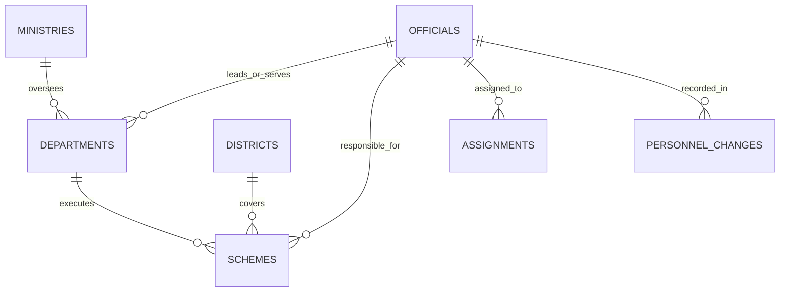

# VERTRI TN AI OS
## Enterprise AI Operating System for Governance, Intelligence & Decision Support
### Government of Tamil Nadu — Chief Minister's Office (CMO)

---

## 🏛️ System Overview

**VERTRI TN AI OS** is a production-grade, relationship-aware AI Operating System engineered for the **Hon'ble Chief Minister of Tamil Nadu, Cabinet Ministers, Chief Secretary, District Collectors, Superintendents of Police, and Secretariat Leadership**.

The platform unifies disparate departmental data silos into an intelligent, queryable, relationship-aware operating environment with:
1. **Natural-Language & Voice-Ready Query Interface**: Tool-augmented AI Agent (Claude Sonnet / LangGraph) retrieving structured government data with deterministic guardrails and cryptographic source citations.
2. **Enterprise Government Relationship Management (GRM)**: Single source of truth for all Tamil Nadu officials across **IAS, IPS, IRS, IFS, and State Cadres** with 21-tier organizational mapping and verified CUG contacts.
3. **Four-Dimensional Core Governance Model**: Relational PostgreSQL 16 + pgvector semantic retrieval + Graph Edge mapping connecting Officials $\leftrightarrow$ Departments $\leftrightarrow$ Schemes $\leftrightarrow$ 38 Districts.
4. **Data Ingestion & Synchronization Pipeline**: Scheduled ETL scrapers and PDF parsers (`pdfplumber`) synchronizing Tamil Nadu Gazettes, AG IAS lists, and CCTNS registries with SHA-256 provenance hashes.
5. **Two-Way Citizen-Government Trust Gateway (*Jan-Samvad*)**: Bridging the gap between the Secretariat and the 72+ million citizens with public-safe office locators, eligibility matchers (*Ungal Thittam*), and WhatsApp/1100 voice grievance ingestion.

---

## 📸 Executive Visual Platform Showcase

| Chief Minister's Command Cockpit | Enterprise Government Directory (GRM) |
|:---:|:---:|
|  |  |

| 21-Tier Government Org Chart | AI Meeting Relationship Intel |
|:---:|:---:|
|  |  |

| Multi-View Official Calendar Hub |
|:---:|
|  |

---

## 🗄️ Four-Dimensional Core Data Model



### 1. `officials` (Master Personnel Registry)
- `id` (PK, e.g. `IAS-TN-2015-042`), `full_name_en`, `full_name_ta`, `cadre` (IAS, IPS, IRS, IFS, STATE, MINISTER, MLA), `batch_year`, `current_posting`, `department_id`, `ministry_id`, `designation_rank`, `phone_landline`, `phone_mobile`, `official_email`, `office_address`, `posting_effective_date`, `expected_retirement`, `status`, `source_refs`.

### 2. `departments` & `ministries`
- `id`, `name_en`, `name_ta`, `ministry_id`, `minister_official_id`, `secretary_official_id`, `parent_department_id`, `contact_phone`, `contact_email`, `address`, `source_refs`.

### 3. `schemes` (State Welfare & Infrastructure)
- `id`, `name_en`, `name_ta`, `department_id`, `owning_ministry_id`, `responsible_official_ids`, `budget_sanctioned`, `budget_released`, `financial_year`, `status` (PLANNED, IN_PROGRESS, COMPLETED, DELAYED, ON_HOLD), `progress_percent`, `milestones`, `geography_ids`, `sector`, `source_refs`.

### 4. `districts` (38 Administrative Jurisdictions)
- `id`, `name_en`, `name_ta`, `region`, `mp_constituencies`, `assembly_constituencies`, `key_indicators`.

### 5. `assignments` (Graph Edges Table)
- `id`, `official_id`, `entity_type` (DEPARTMENT, SCHEME, DISTRICT, COMMITTEE), `entity_id`, `role`, `since`, `until`, `notes`.

### 6. `personnel_changes` (Audit Timeline)
- `id`, `official_id`, `change_type` (TRANSFER, PROMOTION, RETIREMENT, CHARGE), `from_role`, `to_role`, `effective_date`, `order_ref` (G.O. Ms. No.).

---

## 🤖 AI Agent Architecture & Callable Tools

The system orchestrates an Anthropic Claude 3.5 Sonnet agent using a strict tool-calling loop with deterministic database routing:

| Tool | Purpose | Output Format |
|---|---|---|
| `find_official` | Fuzzy multi-attribute search for officials | Summary Card + Contact Details |
| `get_department_overview` | Portfolio, Minister, Secretary, and active schemes | Department Dossier |
| `get_scheme_progress` | Budget, progress %, milestones, and officers | Scheme Progress Card + Table |
| `get_district_overview` | Deployed Collectors, SPs, and district schemes | 38-District Intelligence View |
| `search_contacts` | Faceted contact directory across 5 dimensions | Paginated Contact Grid |
| `get_personnel_changes` | Chronological transfer and posting timeline | Gazette Audit Trail |
| `cross_query` | Intersectional query across entities | Relational Graph Matrix |
| `export_contacts` | Export filtered official directory | CSV, PDF, or vCard file |

---

## 🔒 Security, Clearance & PII Guardrails

1. **No Hallucination**: Contact details and financial metrics are queried directly from verified PostgreSQL records. If absent, the agent reports `"Data not available in official records — source: {last_sync}"`.
2. **Mandatory Source Citation**: Every claim links to verified Government Orders or official portal URLs.
3. **Role-Based Clearance (RBAC)**:
   - `CM_CS_CABINET`: Unredacted CUG lines, encrypted video meet triggers, direct executive directives.
   - `ANALYST_STAFF`: Official office PBX and department reception channels only.
   - `PUBLIC`: *Jan-Samvad* public reception hours, nodal RTI officers, and complaint desks.
4. **Immutable Audit Trail**: 100% of queries, tool calls, and data sync jobs are cryptographically logged.

---

## 🚀 Quick Start & Development

### 1. Backend (FastAPI + AsyncPG + Celery)
```bash
cd backend
python3 -m venv venv && source venv/bin/activate
pip install -r requirements.txt
uvicorn app.main:app --host 0.0.0.0 --port 8001 --reload
```

### 2. Frontend (React + Vite + Tailwind)
```bash
cd frontend
npm install
npm run dev # Starts development server on port 3000
```

### 3. Production Verification Build
```bash
cd frontend
npm run build
```

---

## 📚 Core Documentation Suite

1. **[01. Executive Summary & Strategic Critique](docs/01_EXECUTIVE_SUMMARY_AND_CRITIQUE.md)**: High-level governance vision, the 7 critical AI risks, and transformation roadmap.
2. **[02. System Architecture & API Specification](docs/02_SYSTEM_ARCHITECTURE_AND_API.md)**: Four-dimensional relational schema, 8 AI agent tools, ETL pipelines, and REST endpoints.
3. **[03. Ministers & Officials Operational Playbook](docs/03_MINISTERS_AND_OFFICIALS_PLAYBOOK.md)**: Role-based scenarios, bilingual query cheat-sheets, UI screenshots, and 1-click execution workflows.
4. **[04. Deployment & Operational Runbook](docs/04_DEPLOYMENT_AND_RUNBOOK.md)**: Local dev setup, Docker, Kubernetes manifests, CI/CD pipelines, and observability.