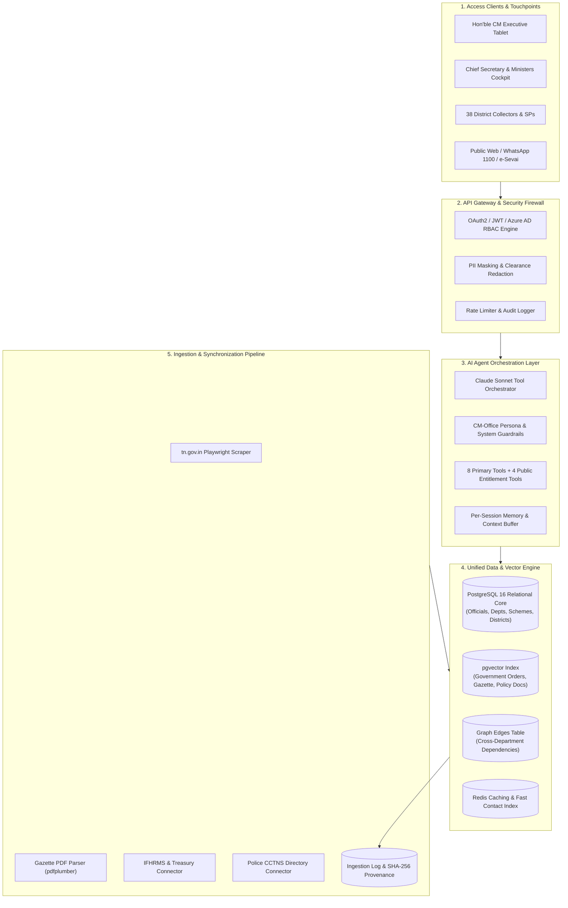

# VERTRI TN AI OS — Full System Architecture Specification
## CMO Enterprise AI Agent & Multi-Tier Governance Operating System

---

## 1. System Topology & Data Flow



---

## 2. Core Relational Schema & Graph Edges

### Table 1: `officials`
```sql
CREATE TYPE cadre_type AS ENUM ('IAS', 'IPS', 'IRS', 'IFS', 'STATE', 'MINISTER', 'MLA');
CREATE TYPE status_type AS ENUM ('ACTIVE', 'LEAVE', 'SUSPENDED', 'TRANSFERRED', 'RETIRED');

CREATE TABLE officials (
    id VARCHAR(64) PRIMARY KEY, -- e.g., 'IAS-TN-2015-042'
    full_name_en VARCHAR(255) NOT NULL,
    full_name_ta VARCHAR(255) NOT NULL,
    cadre cadre_type NOT NULL,
    batch_year INT,
    current_posting VARCHAR(255) NOT NULL,
    department_id VARCHAR(64) REFERENCES departments(id),
    ministry_id VARCHAR(64) REFERENCES ministries(id),
    designation_rank VARCHAR(64) NOT NULL,
    phone_landline VARCHAR(32),
    phone_mobile VARCHAR(32),
    official_email VARCHAR(128) NOT NULL,
    office_address TEXT NOT NULL,
    posting_effective_date DATE NOT NULL,
    expected_retirement DATE,
    status status_type DEFAULT 'ACTIVE',
    notes TEXT,
    source_refs JSONB NOT NULL DEFAULT '[]'::jsonb,
    created_at TIMESTAMP WITH TIME ZONE DEFAULT CURRENT_TIMESTAMP,
    updated_at TIMESTAMP WITH TIME ZONE DEFAULT CURRENT_TIMESTAMP
);
CREATE INDEX idx_officials_cadre ON officials(cadre);
CREATE INDEX idx_officials_dept ON officials(department_id);
```

### Table 2: `departments`
```sql
CREATE TABLE departments (
    id VARCHAR(64) PRIMARY KEY,
    name_en VARCHAR(255) NOT NULL,
    name_ta VARCHAR(255) NOT NULL,
    ministry_id VARCHAR(64) REFERENCES ministries(id),
    minister_official_id VARCHAR(64) REFERENCES officials(id),
    secretary_official_id VARCHAR(64) REFERENCES officials(id),
    parent_department_id VARCHAR(64) REFERENCES departments(id),
    contact_phone VARCHAR(32),
    contact_email VARCHAR(128),
    address TEXT,
    source_refs JSONB NOT NULL DEFAULT '[]'::jsonb
);
```

### Table 3: `schemes`
```sql
CREATE TYPE scheme_status AS ENUM ('PLANNED', 'IN_PROGRESS', 'COMPLETED', 'DELAYED', 'ON_HOLD');

CREATE TABLE schemes (
    id VARCHAR(64) PRIMARY KEY,
    name_en VARCHAR(255) NOT NULL,
    name_ta VARCHAR(255) NOT NULL,
    department_id VARCHAR(64) REFERENCES departments(id),
    owning_ministry_id VARCHAR(64) REFERENCES ministries(id),
    responsible_official_ids TEXT[] NOT NULL,
    budget_sanctioned NUMERIC(15,2) NOT NULL,
    budget_released NUMERIC(15,2) NOT NULL,
    financial_year VARCHAR(16) NOT NULL,
    status scheme_status DEFAULT 'IN_PROGRESS',
    progress_percent NUMERIC(5,2) DEFAULT 0.00,
    milestones JSONB NOT NULL DEFAULT '[]'::jsonb,
    geography_ids TEXT[] NOT NULL,
    sector VARCHAR(128),
    source_refs JSONB NOT NULL DEFAULT '[]'::jsonb
);
```

### Table 4: `districts`
```sql
CREATE TABLE districts (
    id VARCHAR(32) PRIMARY KEY,
    name_en VARCHAR(128) NOT NULL,
    name_ta VARCHAR(128) NOT NULL,
    region VARCHAR(64) NOT NULL,
    mp_constituencies TEXT[] NOT NULL,
    assembly_constituencies TEXT[] NOT NULL,
    key_indicators JSONB NOT NULL DEFAULT '{}'::jsonb
);
```

### Table 5: `assignments` (Graph Edges Table)
```sql
CREATE TYPE entity_type_enum AS ENUM ('DEPARTMENT', 'SCHEME', 'DISTRICT', 'COMMITTEE');

CREATE TABLE assignments (
    id UUID PRIMARY KEY DEFAULT gen_random_uuid(),
    official_id VARCHAR(64) REFERENCES officials(id) ON DELETE CASCADE,
    entity_type entity_type_enum NOT NULL,
    entity_id VARCHAR(64) NOT NULL,
    role VARCHAR(128) NOT NULL,
    since DATE NOT NULL,
    until DATE,
    notes TEXT
);
CREATE INDEX idx_assignments_official ON assignments(official_id);
CREATE INDEX idx_assignments_entity ON assignments(entity_type, entity_id);
```

### Table 6: `personnel_changes` (Audit Timeline)
```sql
CREATE TYPE change_type_enum AS ENUM ('TRANSFER', 'PROMOTION', 'RETIREMENT', 'CHARGE', 'DEPUTATION');

CREATE TABLE personnel_changes (
    id UUID PRIMARY KEY DEFAULT gen_random_uuid(),
    official_id VARCHAR(64) REFERENCES officials(id),
    change_type change_type_enum NOT NULL,
    from_role VARCHAR(255),
    to_role VARCHAR(255) NOT NULL,
    effective_date DATE NOT NULL,
    order_ref VARCHAR(128) NOT NULL, -- G.O. (Ms) No.
    created_at TIMESTAMP WITH TIME ZONE DEFAULT CURRENT_TIMESTAMP
);
```

---

## 3. AI Agent Tool Specification

The agent runtime exposes **8 core tool functions** via Claude Sonnet Tool Calling:

```python
# 1. find_official
def find_official(query: str, filters: dict = None) -> list[dict]: ...

# 2. get_department_overview
def get_department_overview(department_name_or_id: str) -> dict: ...

# 3. get_scheme_progress
def get_scheme_progress(scheme_name_or_id: str, district: str = None) -> dict: ...

# 4. get_district_overview
def get_district_overview(district_name: str) -> dict: ...

# 5. search_contacts
def search_contacts(filters: dict, page: int = 1, page_size: int = 20) -> dict: ...

# 6. get_personnel_changes
def get_personnel_changes(date_from: str, date_to: str, cadre: str = None, department: str = None) -> list[dict]: ...

# 7. cross_query
def cross_query(entities: dict) -> dict: ...

# 8. export_contacts
def export_contacts(format: str, filters: dict) -> dict: ...
```

---

## 4. Security, RBAC & Clearance Matrix

| Role | Contact Data Visible | Financial Intelligence | Executive Directives | Audit Log Access |
|---|---|---|---|---|
| **Chief Minister (CM)** | Full unredacted (CUG + Direct) | Full State Financials | 1-Click Directives | Full State Audit |
| **Chief Secretary (CS)** | Full unredacted (CUG + Direct) | Departmental Financials | Administrative Orders | Full Administration |
| **Ministers & PS** | Departmental unredacted | Departmental Financials | Department Directives | Department Logs |
| **District Collectors & SPs** | District unredacted | District Schemes | District Directives | District Logs |
| **Secretariat Analysts** | Official Office PBX only | Aggregated Stats only | None | Read-only |
| **Public / Citizens** | Jan-Samvad Reception only | Public Scheme Stats | Citizen Grievance Only | Self Petitions |
