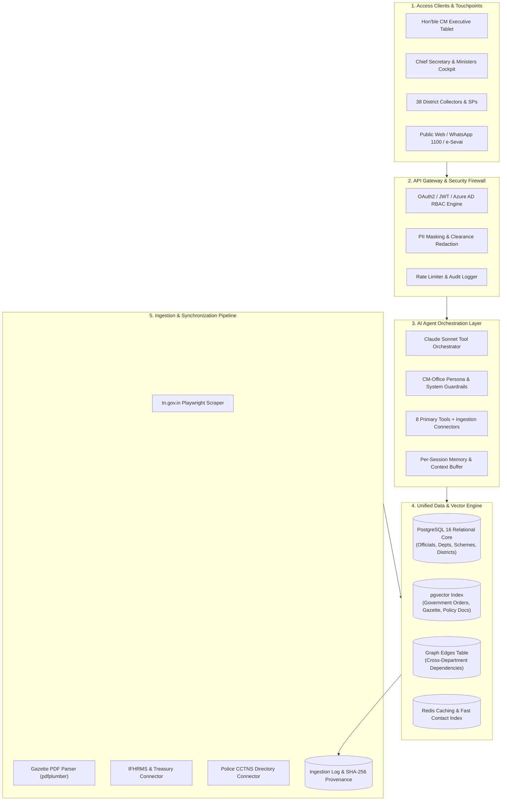
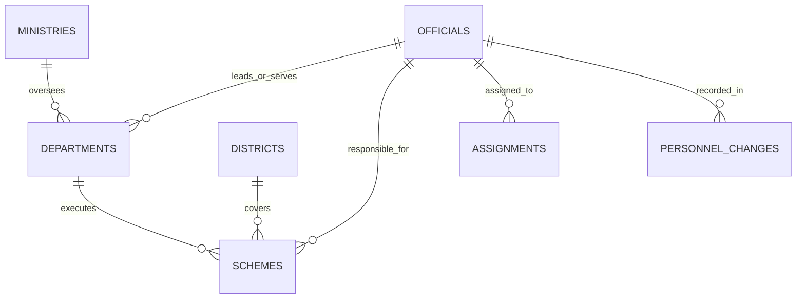

# VERTRI TN AI OS — System Architecture & API Specification
## Multi-Tier Enterprise Architecture, Data Model & Agent Engine

---

## 🏗️ 1. Multi-Tier System Topology

---

## 🗄️ 2. Four-Dimensional Core Relational Schema

### Table 1: `officials` (Master Personnel Registry)
- `id` (PK, e.g. `IAS-TN-2015-042`), `full_name_en`, `full_name_ta`, `cadre` (IAS, IPS, IRS, IFS, STATE, MINISTER, MLA), `batch_year`, `current_posting`, `department_id`, `ministry_id`, `designation_rank`, `phone_landline`, `phone_mobile`, `official_email`, `office_address`, `posting_effective_date`, `expected_retirement`, `status`, `source_refs`.

### Table 2: `departments` & `ministries`
- `id`, `name_en`, `name_ta`, `ministry_id`, `minister_official_id`, `secretary_official_id`, `parent_department_id`, `contact_phone`, `contact_email`, `address`, `source_refs`.

### Table 3: `schemes` (State Welfare & Infrastructure)
- `id`, `name_en`, `name_ta`, `department_id`, `owning_ministry_id`, `responsible_official_ids`, `budget_sanctioned`, `budget_released`, `financial_year`, `status` (PLANNED, IN_PROGRESS, COMPLETED, DELAYED, ON_HOLD), `progress_percent`, `milestones`, `geography_ids`, `sector`, `source_refs`.

### Table 4: `districts` (38 Administrative Jurisdictions)
- `id`, `name_en`, `name_ta`, `region`, `mp_constituencies`, `assembly_constituencies`, `key_indicators`.

### Table 5: `assignments` (Graph Edges Table)
- `id`, `official_id`, `entity_type` (DEPARTMENT, SCHEME, DISTRICT, COMMITTEE), `entity_id`, `role`, `since`, `until`, `notes`.

### Table 6: `personnel_changes` (Audit Timeline)
- `id`, `official_id`, `change_type` (TRANSFER, PROMOTION, RETIREMENT, CHARGE), `from_role`, `to_role`, `effective_date`, `order_ref` (G.O. Ms. No.).

---

## 🤖 3. AI Agent Callable Tools

The system orchestrates an Anthropic Claude 3.5 Sonnet agent using a strict tool-calling loop with deterministic database routing:

| Tool | Purpose | Output Format |
|---|---|---|
| `find_official` | Multi-attribute search for officials | Summary Card + Contact Details |
| `get_department_overview` | Portfolio, Minister, Secretary, and active schemes | Department Dossier |
| `get_scheme_progress` | Budget, progress %, milestones, and officers | Scheme Progress Card + Table |
| `get_district_overview` | Deployed Collectors, SPs, and district schemes | 38-District Intelligence View |
| `search_contacts` | Faceted contact directory across 5 dimensions | Paginated Contact Grid |
| `get_personnel_changes` | Chronological transfer and posting timeline | Gazette Audit Trail |
| `cross_query` | Intersectional query across entities | Relational Graph Matrix |
| `export_contacts` | Export filtered official directory | CSV, PDF, or vCard file |

---

## 🔌 4. REST API Endpoint Specifications

All endpoints are prefixed with `/api/v1/cmo`:

| Method | Endpoint | Description | Query Parameters / Body |
|---|---|---|---|
| `POST` | `/api/v1/cmo/chat` | Natural-Language AI Query | `{ "query": str, "session_id": str, "role_clearance": str }` |
| `GET` | `/api/v1/cmo/officials` | Search Official Directory | `q`, `cadre`, `department` |
| `GET` | `/api/v1/cmo/departments/{dept_id}` | Department Overview | Path: `dept_id` |
| `GET` | `/api/v1/cmo/schemes/{scheme_id}` | Scheme Progress & Budget | Path: `scheme_id`, Query: `district` |
| `GET` | `/api/v1/cmo/districts/{district_name}` | 38-District Intelligence | Path: `district_name` |
| `GET` | `/api/v1/cmo/contacts` | Faceted Contact Search | `cadre`, `department`, `rank`, `keyword`, `page` |
| `GET` | `/api/v1/cmo/personnel-changes` | Civil Services Transfer Log | `date_from`, `date_to`, `cadre`, `department` |
| `POST` | `/api/v1/cmo/cross-query` | Graph Intersection | `{ "officials": [], "schemes": [], "districts": [] }` |
| `GET` | `/api/v1/cmo/export` | Downloadable CSV/PDF/vCard | `format=csv`, `cadre=IAS` |

---

## 🔒 5. Security, Clearance & PII Guardrails

1. **Deterministic Execution**: Zero LLM hallucination of contact coordinates or financial numbers.
2. **Mandatory Source Citations**: Every output references verified Government Orders or official portal URLs.
3. **Role-Based Clearance (RBAC)**:
   - `CM_CS_CABINET`: Unredacted CUG lines, encrypted video meet triggers, direct executive directives.
   - `ANALYST_STAFF`: Official office PBX and department reception channels only.
   - `PUBLIC`: *Jan-Samvad* public reception hours, nodal RTI officers, and complaint desks.
4. **Immutable Audit Trail**: 100% of queries, tool calls, and data sync jobs are cryptographically logged.
