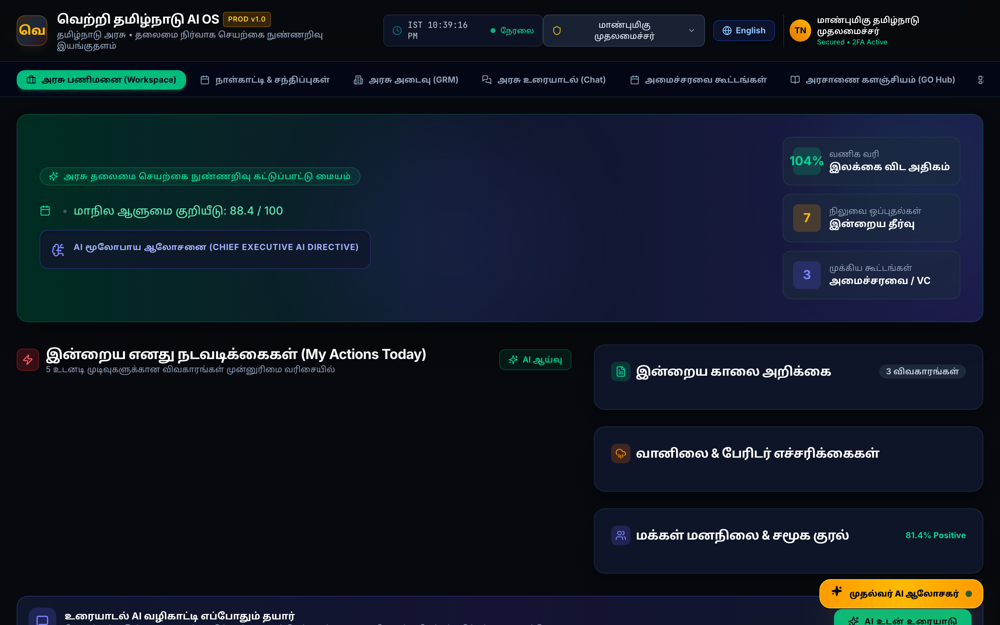
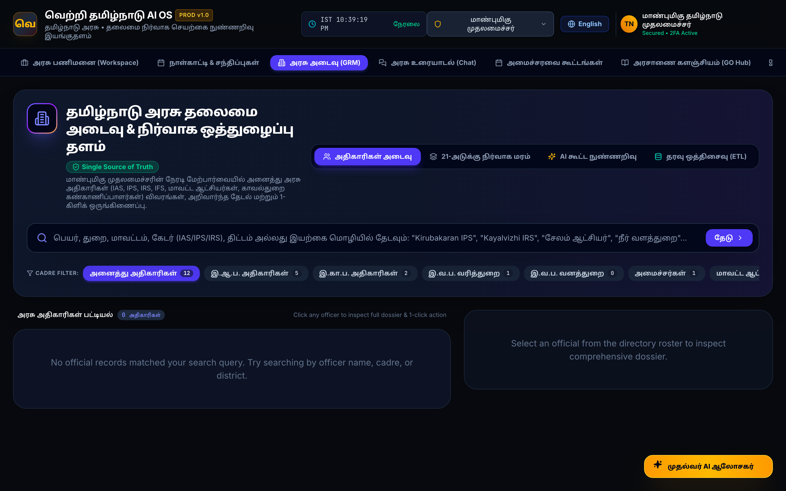
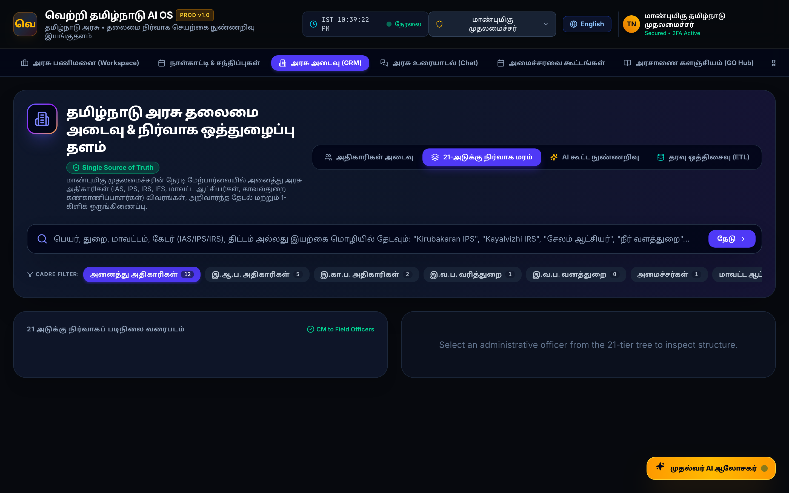
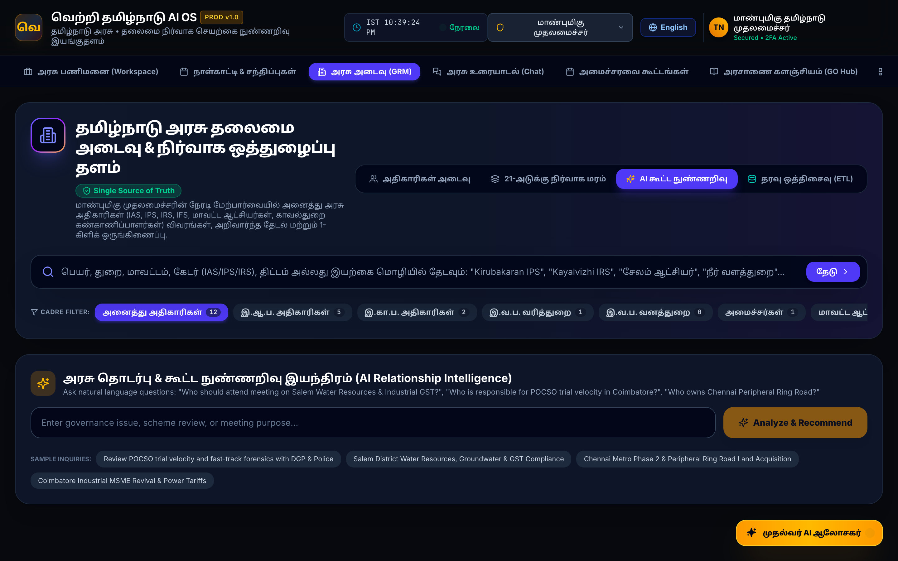
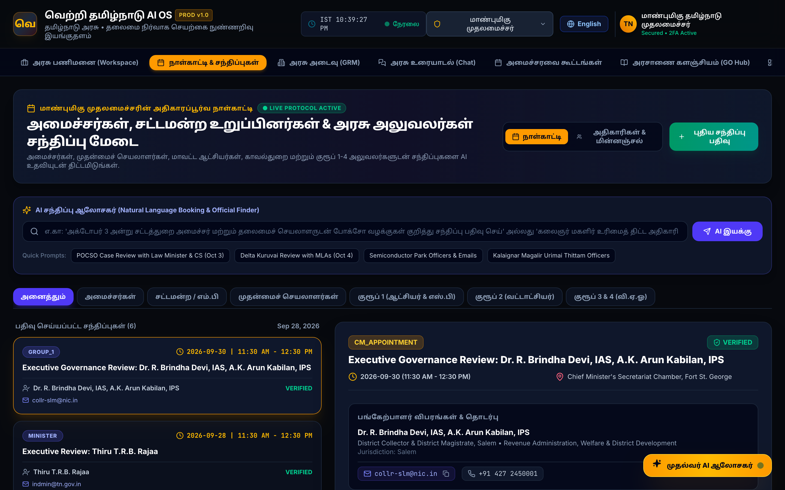

# VERTRI TN AI OS — Ministers & Officials Use Cases Playbook
## Executive Operational Guide for Tamil Nadu State Leadership
**Target Audience:** Hon'ble Chief Minister, Cabinet Ministers, Chief Secretary, Principal Secretaries, District Collectors, Superintendents of Police, and Field Administrative Officers.

---

## 🏛️ Executive Visual Platform Overview

### 1. Chief Minister's Executive AI Command Cockpit
Real-time state telemetry, prioritized daily actions, flagship scheme health, and instant 1-click executive directives.



---

### 2. Enterprise Government Relationship Management (GRM) & Unified Directory
Single source of truth for all Tamil Nadu Government Officials across **IAS, IPS, IRS, IFS, and State Cadres** with verified CUG lines, active schemes, performance scores, and instant collaboration actions.



---

### 3. Interactive 21-Tier Hierarchy Org Chart
Navigable administrative lineage from the Hon'ble Chief Minister $\rightarrow$ Chief Secretary $\rightarrow$ Principal Secretaries $\rightarrow$ Collectors $\rightarrow$ SPs $\rightarrow$ Tahsildars $\rightarrow$ BDOs $\rightarrow$ VAOs.



---

### 4. AI Relationship & Meeting Intelligence Engine
Automated attendees recommendation, cross-departmental collaborator mapping, and AI Pre-Meeting Briefing Strategy Dossiers.



---

### 5. Multi-View Executive Calendar & Appointments Hub
Seamless synchronization of CM reviews, Cabinet meetings, assembly sessions, district inspections, and video conferences.



---

## 📋 Role-Based Use Case Navigation

| User Role | Primary Objectives | Key Features Used |
|---|---|---|
| **Hon'ble Chief Minister (மாண்புமிகு முதலமைச்சர்)** | State Command, Emergency Interventions, Directive Dispatch | CMO AI Copilot, 1-Click Directives, Executive Calendar |
| **Cabinet Ministers (அமைச்சர்கள்)** | Portfolio Monitoring, Fiscal Expenditure, Scheme Saturation | Departmental Intelligence Hub, Scheme Tracker |
| **Chief Secretary & Secretaries (தலைமைச் செயலாளர்)** | Civil Service Coordination, Deadlock Resolution, Cabinet Briefings | 21-Tier Org Chart, Personnel Timeline, Cross-Query Engine |
| **District Collectors (மாவட்ட ஆட்சியர்கள்)** | Field Governance, *Makkaludan Mudhalvar*, Land Clearance | 38-District GIS Cockpit, SLA Queue, Field Dossiers |
| **Superintendents of Police (காவல் கண்காணிப்பாளர்கள்)** | Law & Order, POCSO Trial Velocities, SITREP | Police SITREP Radar, CCTNS Directory, Emergency Mobilizer |
| **Field Officers (Tahsildars / BDOs / VAOs)** | First-Mile Beneficiary Delivery, Camp Operations | *Ungal Thittam* Matcher, Verified Mobile Verification |
| **The Public / Citizens (பொதுமக்கள்)** | Entitlement Discovery, Transparent Grievance Tracking | *Jan-Samvad* Safe Directory, 1100 / WhatsApp Tamil Voice |

---

## 1. Hon'ble Chief Minister & CMO Executive Scenarios

### Scenario 1.1: Instant Official Discovery & 1-Click Review Meeting
* **Context:** The Hon'ble CM needs an urgent briefing on Salem district water resources and industrial GST compliance.
* **Conversational AI Prompt:**
  > *"Who is the SP of Salem and District Collector? Schedule a video review on Oct 4 at 3 PM."*
* **System Action:**
  1. AI identifies `Dr. R. Brindha Devi, IAS` (Collector) and `Kirubakaran, IPS` (SP).
  2. Pulls verified CUG contacts, active AMRUT 2.0 water projects, and POCSO trial rates.
  3. Pre-populates AI Meeting Briefing Dossier (Agenda, Critical Questions, G.O. References).
  4. Dispatches encrypted video meeting invite and books the Executive Calendar in 1 click.

### Scenario 1.2: Cross-Departmental Infrastructure Bottleneck Resolution
* **Context:** The Chennai Peripheral Ring Road (Section II) is delayed by 45 days due to land acquisition in Ponneri Taluk.
* **Conversational AI Prompt:**
  > *"Why is the Peripheral Ring Road stalled and who is responsible?"*
* **System Action:**
  1. Graph Edge engine identifies deadlock between Highways Dept and District Collectorate, Tiruvallur.
  2. Generates Executive Directive: *"Direct Collector Tiruvallur to convene Special Lok Adalat for immediate compensation settlement."*
  3. CM clicks **"Dispatch Directive"** $\rightarrow$ Dispatched to Collector's terminal with automated SMS/email alert.

---

## 2. Cabinet Ministers: Portfolio & Scheme Saturation

### Scenario 2.1: Health Minister Drug Stock & Hospital Monitoring
* **Role:** Hon'ble Minister for Health and Family Welfare
* **Prompt / Action:**
  > *"Show Madurai Government Rajaji Hospital essential drug stock and TNMSC dispatch status."*
* **System Output:**
  - Displays alert: Anti-D Globulin stock below 15% safety threshold.
  - 1-Click Action: **"Trigger TNMSC Central Drug Depot Immediate Priority Dispatch"**.
  - Logs cryptographic audit trail of the ministerial order.

### Scenario 2.2: Finance & Commercial Taxes Saturation Review
* **Role:** Hon'ble Minister for Finance & Commercial Taxes
* **Prompt / Action:**
  > *"Show GST compliance rates across Western Region and Madurai Division."*
* **System Output:**
  - Identifies `Kayalvizhi, IRS` (Joint Commissioner, Commercial Taxes Madurai) with 104.2% collection achievement.
  - Highlights MSME industrial stress in Tirupur dyeing clusters.
  - Recommends policy review on textile power tariffs.

---

## 3. Chief Secretary & Principal Secretaries: Administrative Command

### Scenario 3.1: Civil Services Posting & Transfer Audit Timeline
* **Role:** Chief Secretary to Government
* **Prompt:**
  > *"Show recent IAS and IPS transfers in the last 60 days with G.O. gazette numbers."*
* **System Output:**
  - Interactive chronological timeline of postings (e.g., `G.O.(Rt) No. 421`, `G.O.(Rt) No. 204`, `G.O.(Ms) No. 3412`).
  - 1-Click Export: **"Download Civil Service Transfer Gazette (PDF/CSV)"**.

### Scenario 3.2: Automated Cabinet Meeting Pre-Briefing Dossier
* **Role:** Principal Secretary (Coordination)
* **Prompt:**
  > *"Prepare Cabinet pre-briefing on Kalaignar Magalir Urimai Thittam expansion and financial outlay."*
* **System Output:**
  - Auto-compiles Sanctioned vs. Released Budgets (₹13,720 Cr / ₹13,580 Cr).
  - 1.15 Crore beneficiary saturation metrics.
  - Auto-generates draft Cabinet Note with inter-departmental signatures.

---

## 4. District Collectors & Superintendents of Police (Ground Realities)

### Scenario 4.1: Monday Public Grievance Day (*Makkaludan Mudhalvar*)
* **Role:** District Collector & District Magistrate (Salem / Coimbatore / Kallakurichi)
* **Workflow:**
  1. Collector opens **District Cockpit**.
  2. AI categorizes incoming petitions into **High Priority (Pensions, Patta, Drinking Water)**.
  3. Automatic desk assignment to respective Tahsildar with strict 14-day SLA deadline.
  4. Real-time alert if petition approaches SLA breach (Day 11 Red Flag).

### Scenario 4.2: Fast-Track POCSO & Law and Order Monitoring
* **Role:** Superintendent of Police (SP)
* **Workflow:**
  1. SP queries: *"Show pending POCSO charge-sheets exceeding 60-day statutory limit."*
  2. System filters CCTNS database and highlights 3 pending forensic laboratory reports.
  3. 1-Click Action: **"Escalate to Regional Forensic Science Lab (RFSL) Nodal Officer"**.

---

## 5. Field Administrative Officers: First-Mile Service Delivery

### Scenario 5.1: Taluk Camp & Beneficiary Verification (*Ungal Thittam*)
* **Role:** Tahsildar / Block Development Officer (BDO) / Village Administrative Officer (VAO)
* **Workflow:**
  1. Officer inputs citizen demographic criteria on tablet/mobile.
  2. System instantly displays all eligible schemes:
     - *Kalaignar Magalir Urimai Thittam* (₹1,000/month DBT)
     - *Pudhumai Penn* (Higher education financial assistance)
     - *Chief Minister's Comprehensive Health Insurance Scheme (CMCHIS)*
  3. Officer performs one-tap e-KYC verification.

---

## 6. Citizen & Public Transparency Layer (*Jan-Samvad*)

```
┌─────────────────────────────────────────────────────────────────────────────┐
│                    JAN-SAMVAD PUBLIC ACCESSIBILITY ENGINE                   │
├────────────────────────────────┬────────────────────────────────────────────┤
│ 1. Safe Contact Directory      │ Office address, reception phone, camp times│
│ 2. SLA Breadcrumb Tracker      │ "Your Patta petition is with Tahsildar West"│
│ 3. 1100 / WhatsApp Tamil Voice │ Rural dialect voice note → Grievance ticket│
│ 4. "Ungal Thittam" Matcher     │ 30-second eligibility check for 120 schemes│
└────────────────────────────────┴────────────────────────────────────────────┘
```

### Scenario 6.1: Spoken Tamil Voice Grievance Submission
* **Citizen Action:** Citizen sends a Tamil voice note on WhatsApp / CM Helpline 1100:
  > *"எங்க கிராமத்துல கடந்த 10 நாளா குடிநீர் வரல... உடனே சரி பண்ணுங்க."*
* **System Action:**
  1. Whisper/AI speech-to-text transcribes colloquial Tamil into text.
  2. Tags issue as `DRINKING_WATER_OUTAGE`, maps to `Salem District -> Omalur Block -> Suramangalam Panchayat`.
  3. Generates Ticket `#TN-TWAD-8841` and sends SMS tracking link to citizen.
  4. Directs local TWAD Engineer & BDO with a 48-hour resolution SLA.

---

## 7. Natural Language Query Cheat-Sheet for Leadership

| Objective | Example Query (English) | மாதிரி வினவல் (தமிழ்) |
|---|---|---|
| **Find Official** | *"Who is Kirubakaran IPS?"* | *"கிருபாகரன் இ.கா.ப. யார்? தொடர்பு எண் தருக."* |
| **District Briefing** | *"Show Salem district overview and key officers"* | *"சேலம் மாவட்ட ஆட்சியர் & காவல் கண்காணிப்பாளர் விவரம்."* |
| **Scheme Progress** | *"Progress of Kalaignar Magalir Urimai Thittam"* | *"கலைஞர் மகளிர் உரிமைத் திட்டத்தின் தற்போதைய நிலை என்ன?"* |
| **Personnel Transfers** | *"Recent IAS transfers in the last 30 days"* | *"சமீபத்திய இ.ஆ.ப. அதிகாரிகள் இடமாறுதல் அரசாணைகள்."* |
| **Export Directory** | *"Export all IPS officers to CSV"* | *"அனைத்து இ.கா.ப. அதிகாரிகள் விவரங்களை பதிவிறக்கு."* |
| **Deadlock Resolver** | *"Who is responsible for Chennai Metro Phase 2 delay?"* | *"சென்னை மெட்ரோ திட்டம் தாமதத்திற்கு யார் பொறுப்பு?"* |

---

## 8. Summary of Best Practices for Officials

1. **Always Verify Provenance:** Every response contains a government order reference (`source_refs`). Click the citation to inspect the official PDF.
2. **Use 1-Click Collaboration:** Avoid email delays — use **Schedule Meet**, **Start Video**, or **Assign Directive** directly from the officer profile card.
3. **Respect Clearance Protocols:** Never share internal CUG numbers on unverified public communication channels.
