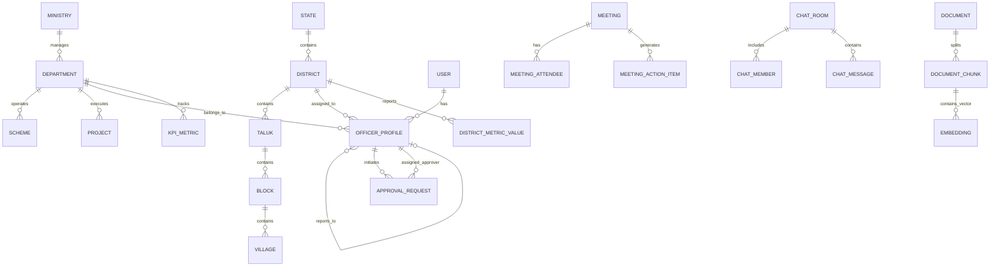

# VETTRI TN AI OS — Database & Data Platform Architecture
### Phase 2 Enhanced Multi-Role Enterprise Architecture

> **System:** VETTRI TN AI OS (*வெற்றி*)  
> **Database Engine:** PostgreSQL 16 Enterprise with `pgvector` 0.7+  
> **Version:** 2.0.0

---

## 1. Relational Entity Relationship (ER) Model



---

## 2. Phase 2 Extended Schema Definitions

```sql
-- Enable necessary extensions
CREATE EXTENSION IF NOT EXISTS "uuid-ossp";
CREATE EXTENSION IF NOT EXISTS "pgcrypto";
CREATE EXTENSION IF NOT EXISTS "vector";

-- 21-Tier Government Hierarchy Roles
CREATE TYPE government_tier_enum AS ENUM (
    'CHIEF_MINISTER',
    'DEPUTY_CHIEF_MINISTER',
    'CABINET_MINISTER',
    'CHIEF_SECRETARY',
    'ADDITIONAL_CHIEF_SECRETARY',
    'PRINCIPAL_SECRETARY',
    'SECRETARY',
    'COMMISSIONER',
    'MISSION_DIRECTOR',
    'HOD',
    'DISTRICT_COLLECTOR',
    'SUPERINTENDENT_OF_POLICE',
    'DISTRICT_REVENUE_OFFICER',
    'JOINT_COLLECTOR',
    'REVENUE_DIVISIONAL_OFFICER',
    'TAHSILDAR',
    'BLOCK_DEVELOPMENT_OFFICER',
    'MUNICIPAL_COMMISSIONER',
    'EXECUTIVE_OFFICER',
    'VILLAGE_ADMINISTRATIVE_OFFICER',
    'FIELD_OFFICER'
);

-- Enhanced Officer Profiles with Hierarchy
CREATE TABLE officer_profiles (
    id UUID PRIMARY KEY DEFAULT gen_random_uuid(),
    user_id UUID UNIQUE NOT NULL REFERENCES users(id) ON DELETE CASCADE,
    official_name_en VARCHAR(150) NOT NULL,
    official_name_ta VARCHAR(150) NOT NULL,
    designation VARCHAR(150) NOT NULL,
    administrative_tier government_tier_enum NOT NULL,
    department_id UUID REFERENCES departments(id),
    district_id UUID REFERENCES districts(id),
    taluk_id UUID REFERENCES taluks(id),
    reports_to_id UUID REFERENCES officer_profiles(id),
    cadre VARCHAR(50),                     -- 'IAS', 'IPS', 'TNS', 'TNAS'
    batch_year INT,
    cug_phone VARCHAR(20) NOT NULL,
    official_email VARCHAR(255) NOT NULL,
    office_address TEXT NOT NULL,
    is_active BOOLEAN DEFAULT TRUE,
    created_at TIMESTAMPTZ DEFAULT CURRENT_TIMESTAMP,
    updated_at TIMESTAMPTZ DEFAULT CURRENT_TIMESTAMP
);

-- Centralized Approvals Center
CREATE TYPE approval_type_enum AS ENUM (
    'BUDGET_SANCTION',
    'PROJECT_APPROVAL',
    'GO_DRAFT',
    'CABINET_NOTE',
    'APPOINTMENT_TRANSFER',
    'CONTRACT_TENDER',
    'POLICY_SANCTION'
);

CREATE TYPE approval_status_enum AS ENUM (
    'PENDING',
    'AI_REVIEWED',
    'APPROVED',
    'REJECTED',
    'ESCALATED'
);

CREATE TABLE approval_requests (
    id UUID PRIMARY KEY DEFAULT gen_random_uuid(),
    file_number VARCHAR(100) UNIQUE NOT NULL,
    title_en VARCHAR(255) NOT NULL,
    title_ta VARCHAR(255) NOT NULL,
    approval_type approval_type_enum NOT NULL,
    department_id UUID NOT NULL REFERENCES departments(id),
    initiator_id UUID NOT NULL REFERENCES officer_profiles(id),
    current_approver_id UUID NOT NULL REFERENCES officer_profiles(id),
    status approval_status_enum DEFAULT 'PENDING',
    priority VARCHAR(20) DEFAULT 'MEDIUM', -- 'LOW', 'MEDIUM', 'HIGH', 'EMERGENCY'
    financial_impact_crores NUMERIC(14, 2) DEFAULT 0.00,
    ai_summary TEXT,
    ai_risk_score NUMERIC(5, 2),            -- 0.00 to 100.00
    ai_recommendation TEXT,
    digital_signature_hash VARCHAR(128),
    created_at TIMESTAMPTZ DEFAULT CURRENT_TIMESTAMP,
    resolved_at TIMESTAMPTZ
);

-- Secure Government Chat & Channels
CREATE TABLE chat_rooms (
    id UUID PRIMARY KEY DEFAULT gen_random_uuid(),
    name VARCHAR(150) NOT NULL,
    room_type VARCHAR(50) NOT NULL,         -- 'DIRECT', 'DEPARTMENT', 'DISTRICT', 'CABINET', 'EMERGENCY'
    department_id UUID REFERENCES departments(id),
    district_id UUID REFERENCES districts(id),
    is_encrypted BOOLEAN DEFAULT TRUE,
    created_at TIMESTAMPTZ DEFAULT CURRENT_TIMESTAMP
);

CREATE TABLE chat_members (
    id UUID PRIMARY KEY DEFAULT gen_random_uuid(),
    room_id UUID NOT NULL REFERENCES chat_rooms(id) ON DELETE CASCADE,
    officer_id UUID NOT NULL REFERENCES officer_profiles(id) ON DELETE CASCADE,
    joined_at TIMESTAMPTZ DEFAULT CURRENT_TIMESTAMP,
    UNIQUE(room_id, officer_id)
);

CREATE TABLE chat_messages (
    id UUID PRIMARY KEY DEFAULT gen_random_uuid(),
    room_id UUID NOT NULL REFERENCES chat_rooms(id) ON DELETE CASCADE,
    sender_id UUID NOT NULL REFERENCES officer_profiles(id),
    content TEXT NOT NULL,
    content_ta TEXT,
    message_type VARCHAR(30) DEFAULT 'TEXT', -- 'TEXT', 'FILE', 'VOICE_NOTE', 'APPROVAL_CARD'
    attachment_url VARCHAR(500),
    is_pinned BOOLEAN DEFAULT FALSE,
    created_at TIMESTAMPTZ DEFAULT CURRENT_TIMESTAMP
);

-- Executive Meeting Intelligence
CREATE TABLE meetings (
    id UUID PRIMARY KEY DEFAULT gen_random_uuid(),
    title VARCHAR(255) NOT NULL,
    meeting_type VARCHAR(50) NOT NULL,      -- 'CABINET', 'DISTRICT_COLLECTOR_REVIEW', 'DEPARTMENT_REVIEW'
    organizer_id UUID NOT NULL REFERENCES officer_profiles(id),
    scheduled_start TIMESTAMPTZ NOT NULL,
    scheduled_end TIMESTAMPTZ NOT NULL,
    status VARCHAR(30) DEFAULT 'SCHEDULED', -- 'SCHEDULED', 'IN_PROGRESS', 'COMPLETED', 'CANCELLED'
    meeting_link VARCHAR(255),
    ai_agenda_briefing TEXT,
    ai_generated_minutes TEXT,
    created_at TIMESTAMPTZ DEFAULT CURRENT_TIMESTAMP
);

CREATE TABLE meeting_action_items (
    id UUID PRIMARY KEY DEFAULT gen_random_uuid(),
    meeting_id UUID NOT NULL REFERENCES meetings(id) ON DELETE CASCADE,
    action_text TEXT NOT NULL,
    responsible_officer_id UUID NOT NULL REFERENCES officer_profiles(id),
    deadline DATE NOT NULL,
    status VARCHAR(30) DEFAULT 'PENDING',   -- 'PENDING', 'IN_PROGRESS', 'COMPLETED', 'OVERDUE'
    created_at TIMESTAMPTZ DEFAULT CURRENT_TIMESTAMP
);

-- Comprehensive Schemes Database
CREATE TABLE schemes (
    id UUID PRIMARY KEY DEFAULT gen_random_uuid(),
    code VARCHAR(50) UNIQUE NOT NULL,       -- e.g. 'SCHEME_MUT_2023', 'SCHEME_MTM_2021'
    name_en VARCHAR(255) NOT NULL,
    name_ta VARCHAR(255) NOT NULL,
    department_id UUID NOT NULL REFERENCES departments(id),
    nodal_officer_id UUID REFERENCES officer_profiles(id),
    budget_allocated_crores NUMERIC(14, 2) NOT NULL,
    expenditure_crores NUMERIC(14, 2) DEFAULT 0.00,
    target_beneficiaries BIGINT NOT NULL,
    achieved_beneficiaries BIGINT DEFAULT 0,
    eligibility_criteria JSONB,
    risk_score NUMERIC(5, 2) DEFAULT 0.00,
    ai_recommendation TEXT,
    is_active BOOLEAN DEFAULT TRUE,
    created_at TIMESTAMPTZ DEFAULT CURRENT_TIMESTAMP
);
```
