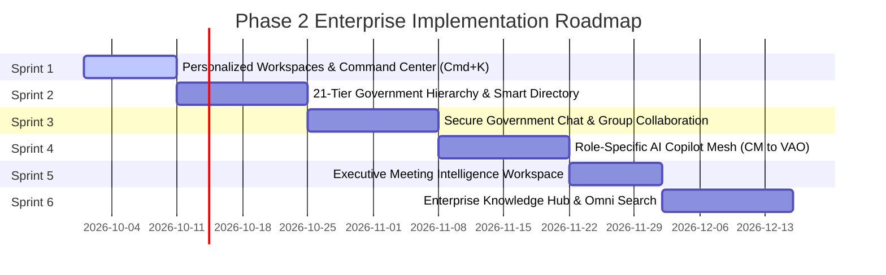

# VETTRI TN AI OS — Development Roadmap & Implementation Plan
### Phase 2: Government Collaboration, AI Copilots & Executive Workspace

> **System:** VETTRI TN AI OS (*வெற்றி*)  
> **Lifecycle:** Enterprise Delivery Model  
> **Target:** Government of Tamil Nadu  
> **Version:** 2.0.0

---

## 1. Phase 2 Implementation Timeline & Sprint Milestones

---

## 2. Detailed Milestone Deliverables, Dependencies, Risks & Effort

| Milestone | Key Deliverables | Architecture & Reusable Components | Dependencies | Estimated Effort | Risk & Mitigation |
| :--- | :--- | :--- | :--- | :--- | :--- |
| **M2.1: Personalized Workspaces & Executive Cockpit** | • Role-tailored Dashboard (`My Tasks`, `My Approvals`, `My Meetings`, `My Briefings`) • Executive Morning/Evening Briefing Engine • Global `Cmd+K` Command Palette | • Reuses existing Glassmorphic Card, Badge, and metric tokens • `/api/v1/executive/workspace` aggregated endpoint | User Auth & JWT Context | **2 Weeks** | **Low:** Low complexity; fully reuses frontend design tokens and backend base. |
| **M2.2: 21-Tier Hierarchy & Smart Directory** | • 21-tier recursive Org Tree visualizer • Officer Profile Dossiers with real-time portfolio & contact • Natural Language semantic directory search | • React Flow / Treebeard visualization • PostgreSQL `pgvector` hybrid search on officer profiles | PostgreSQL 16 + pgvector | **2.5 Weeks** | **Medium:** TN government official directory size. *Mitigation:* Seed initial core Secretariat & Collectorate data with batch synchronization jobs. |
| **M2.3: Secure Government Chat & Collaboration** | • Real-time WebSocket E2EE Messaging • Auto-provisioned hierarchy channels (`cabinet`, `all-collectors`, `district-disaster`) • In-chat AI Summarization & 1-click Task conversion | • Redis Pub/Sub backend • React Virtualized message list with audio player & document previewers | Redis 7 + WebSockets | **3 Weeks** | **Medium:** Message throughput in emergency scenarios. *Mitigation:* Redis cluster horizontal scaling with NATS backup. |
| **M2.4: Role-Specific AI Copilot Mesh** | • Parameterized LangGraph agent runtime for CM, Ministers, Secretaries, Collectors, and Field Officers • Evidence citation engine & Hallucination verification | • LangGraph StateGraph + MCP Tool Mesh • Gemini / Anthropic / Local sovereign LLMs (Ollama) | LangGraph + MCP Layer | **3 Weeks** | **High:** Risk of hallucinated advice. *Mitigation:* Mandatory RAG citation binding and zero-temperature tool execution. |
| **M2.5: Executive Meeting Intelligence Workspace** | • Meeting scheduler with automated participant suggestions • AI Pre-Meeting Briefing Packet generator • Real-time bilingual speech-to-text + Actionable Minutes (MoM) extraction | • MinIO S3 document store • Background Temporal / asyncio transcription workers | MinIO S3 + Speech/LLM API | **2 Weeks** | **Medium:** Heavy background task latency. *Mitigation:* Offload transcription and MoM extraction to asynchronous Celery/Temporal workers. |
| **M2.6: Knowledge Hub & Enterprise Omni Search** | • Department Knowledge Vaults (GOs, Acts, Policies, Circulars) • Unified `OmniSearch` (`/api/v1/search/omni`) combining BM25 keyword + dense vector embeddings | • PostgreSQL tsvector + pgvector HNSW index • Re-ranking pipeline with Reciprocal Rank Fusion (RRF) | Document Ingestion Pipeline | **2.5 Weeks** | **Medium:** Large PDF OCR ingestion. *Mitigation:* Parallel chunking & embedding pipeline. |

---

## 3. Governance & Quality Gate Checklist
- [x] Full RBAC/ABAC isolation between state, district, taluk, and village tiers.
- [x] Complete bilingual parity across all interface components (English & தமிழ்).
- [x] WCAG 2.1 AA accessibility standards (keyboard navigation, high-contrast, screen reader friendly).
- [x] DPDP Act & Tier-1 State Data Center sovereign air-gapped readiness.
