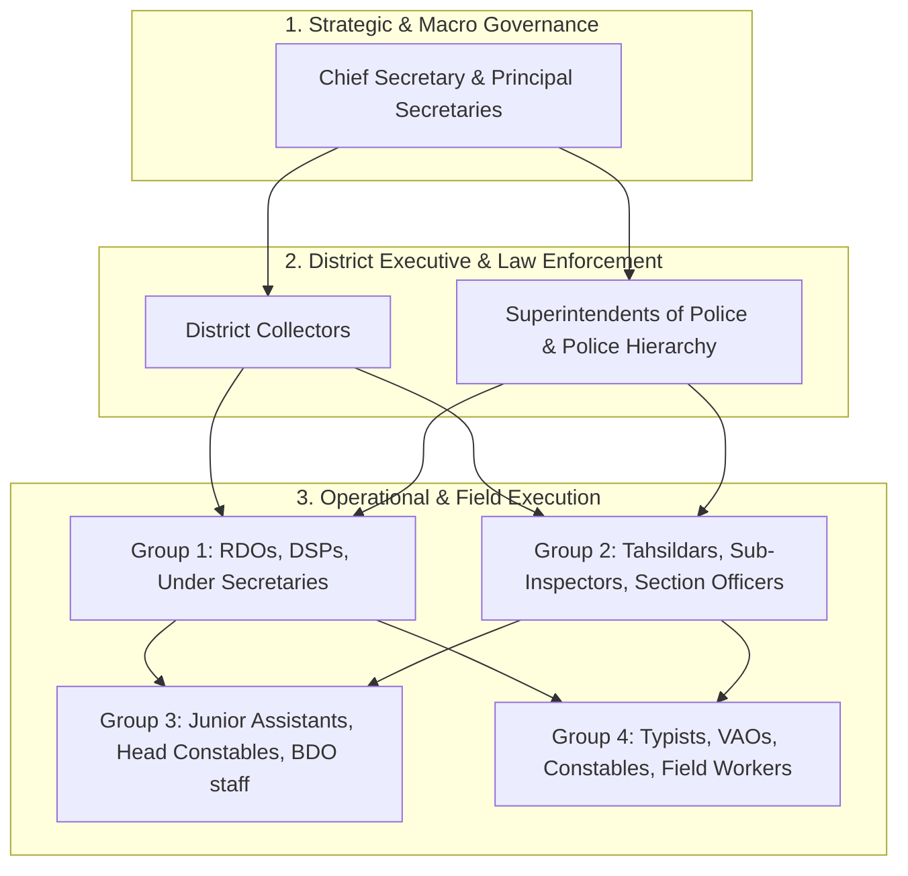

# VETTRI TN AI OS — Multi-Role Administrative & Business Analyst Review
### Comprehensive Needs Assessment, Digital Transformation & AI Workflow Modernization

> **Document Classification:** Official Stakeholder Review & Enterprise Digital Transformation Blueprint  
> **Evaluation Panel:** Chief Secretary, Principal Secretaries, District Collectors, Superintendents of Police & Police Tiers, Group 1/2/3/4 Officers, and Senior Government Business Analyst  
> **Target:** 100% Elimination of Redundant Work, Paper Bottlenecks, and Manual Reporting Delays across Tamil Nadu Governance  

---

## 1. Executive Summary from Senior Government Business Analyst (Digital Transformation Lead)

### The Core Problem in Current Tamil Nadu Governance Workflows
1. **The "Tappal & Tapal Register" Latency:** Files, GO references, and citizen petitions travel sequentially through 6-8 desks (Group 4 Typist $\rightarrow$ Group 2 Assistant $\rightarrow$ Group 1 Under Secretary / RDO $\rightarrow$ Head of Dept / Collector $\rightarrow$ Secretary). Each desk manually re-summarizes prior notes on physical green note-sheets.
2. **Duplicate Periodic Reporting ("DCB - Demand, Collection, Balance"):** Revenue, Agriculture, and Police officers spend 30-40% of their working hours manually collating Excel sheets and Word tables for Weekly Collector Reviews, Monday Morning Grievance Days, and Secretariat Video Conferences (VCs).
3. **Information Asymmetry & Disconnected Silos:** Land records (AnyFVR/Patta), Criminal tracking (CCTNS), Health supplies (TNMSC), Civil Supplies (TNPDS), and Financial sanctions (IFHRMS) do not talk to each other in real-time.

### The VETTRI AI Transformation Model
```
┌────────────────────────────────────────────────────────────────────────┐
│             FROM MANUAL LEGACY → TO VETTRI AI GOVERNANCE               │
├──────────────────────────────────┬─────────────────────────────────────┤
│ Legacy Manual Workflow           │ VETTRI AI Autonomous Workflow       │
├──────────────────────────────────┼─────────────────────────────────────┤
│ 7-day file routing between desks │ Instant auto-drafting & parallel AI │
│                                  │ risk-scored digital routing         │
│ 15-page manual note-sheet triage │ 3-bullet AI Executive Triage & Im-  │
│                                  │ pact Summary (Legal/Fiscal/Public)  │
│ 4-hour weekly report collation   │ Zero-click Real-Time Live Telemetry │
│ Physical meeting attendance only │ AI Pre-briefed Video & Auto-MoM     │
│ Searching across physical files  │ Instant Semantic Omni-Search (RAG)  │
└──────────────────────────────────┴─────────────────────────────────────┘
```

---

## 2. Multi-Role Needs, Pain Points & VETTRI AI Solutions



---

### 2.1 Role 1: Chief Secretary (CS) & Additional Chief Secretaries (ACS)
*“The Chief Administrator orchestrating 40+ departments and keeping the CM informed of all state risks.”*

- **Daily Working Reality:**
  - Flooded with 200+ files daily across Law & Order, Land Allotments, Mega Investments, Court Contempt notices, and Inter-Departmental Disputes.
  - Constant preparation for Cabinet meetings, Assembly Sessions, and High Court appearances.
- **Critical Pain Points:**
  - Department secretaries working in silos (e.g., Highways delayed because TANGEDCO has not shifted power poles, and Forest Dept has not cleared land).
  - Lack of early warning on emerging crises (protests, hospital medicine stockouts, flood inundation).
- **VETTRI Phase 2 Delivery:**
  1. **Inter-Departmental Blocker Matrix:** AI automatically identifies projects where 2+ departments are blocking each other and suggests pre-formulated resolution terms.
  2. **Cabinet Decision Tracker & High-Priority File Triage:** Automatically flags files with pending court contempt deadlines or central grant forfeiture clauses.
  3. **Statewide Critical Alert Stream:** Real-time synthesis of intelligence, law & order, and extreme weather telemetry.

---

### 2.2 Role 2: Principal Secretaries & Department Secretaries (Secretariat Level)
*“The policy architects managing state departmental budgets, major schemes, and Legislative commitments.”*

- **Daily Working Reality:**
  - Defending department budgets, drafting Government Orders (GOs), reviewing District-level performance, answering Assembly Questions (Starred/Unstarred).
- **Critical Pain Points:**
  - Answering Assembly Questions requires sending emergency emails to 38 District Officers who manually type replies, causing 48-hour delays.
  - Tracking scheme expenditure vs. physical ground truth (preventing funds idling in scheme bank accounts).
- **VETTRI Phase 2 Delivery:**
  1. **Automated Assembly Question (AQ) Synthesizer:** Type the MLA question; AI pulls verified data from all 38 districts and draft replies cited with existing GOs in < 30 seconds.
  2. **Fund Utilization & Scheme Velocity Radar:** Direct telemetry connection with IFHRMS to detect fund parking and under-utilization in real-time.
  3. **AI Policy & GO Drafting Assistant:** Generates standard legal drafts with mandatory financial concurrence and personnel clauses verified.

---

### 2.3 Role 3: District Collectors (District Executive Leadership)
*“The ground-level face of government managing 38 districts, coordinating 30+ line departments, and handling public grievances.”*

- **Daily Working Reality:**
  - 14-hour workdays juggling Monday Public Grievance Day, Weekly Line-Department Reviews, Disaster Relief, Protocol visits, Land Acquisition, and CM Dashboard targets.
- **Critical Pain Points:**
  - **Review Meeting Fatigue:** 4 hours spent every week listening to 30 department officers read out outdated PowerPoint slides.
  - **Repetitive Citizen Grievances:** Citizens filing the same Old Age Pension (OAP) or Patta transfer grievance 5 times across CM Cell, Collector Cell, and RDO office.
- **VETTRI Phase 2 Delivery:**
  1. **Automated Weekly Review Dossier:** AI pre-ranks all 30 line-departments by performance variance; Collector focuses only on bottom 10% underperforming taluks.
  2. **Unified Grievance De-Duplication & Root Cause Clustering:** Merges identical citizen petitions across CM Cell / Collectorate and alerts Collector if a specific village officer has a 90% rejection anomaly.
  3. **Disaster & Monsoon Command Cockpit:** GIS rain gauge, water body storage, evacuation camp capacity, and SDRF asset tracker.

---

### 2.4 Role 4: Superintendents of Police (SP), Commissioners & Police Hierarchy
*“Ensuring law, order, crime prevention, VIP security, and rapid emergency response.”*

#### Police Hierarchy Breakdown:
- **DGP / ADGP / Commissioners:** Macro law & order, state intelligence, communal & sensitive festival security.
- **Superintendents of Police (SP) / DCP:** District crime review, bandobast planning, cybercrime, police station inspections.
- **Deputy SP / ACP (Group 1):** Sub-division crime monitoring, grave crime investigation oversight.
- **Inspectors & Sub-Inspectors (Group 2):** Station House Officers (SHOs), FIR registration, charge-sheet filing, daily beat patrols.
- **Head Constables & Constables (Group 3/4):** Beat patrol, court summons delivery, bandobast duty, citizen complaint ground verification.

- **Critical Pain Points:**
  - Manual beat diary entries and paper-based court summons tracking.
  - Lack of cross-district criminal pattern matching (e.g., same motorcycle theft gang operating across 3 neighbouring districts).
  - Heavy paperwork during festival bandobast (allocating 2,000+ personnel across 50 checkpoints).
- **VETTRI Phase 2 Delivery:**
  1. **Automated Bandobast AI Deployment Planner:** Optimizes officer deployment based on crowd density history, sensitive zones, and duty rotation rules.
  2. **Inter-District Crime Correlation Agent:** Cross-analyzes MO (Modus Operandi) across all 38 districts in real-time using CCTNS telemetry.
  3. **Voice-to-Text Mobile FIR & Mahazar Assistant (Tamil/English):** Allows Sub-Inspectors and Constables to dictate spot inspection notes that instantly format into compliant legal records.

---

### 2.5 Role 5: Group 1 Officials (RDOs, DROs, Under Secretaries, Deputy Directors)
*“The senior operational backbone executing administrative inquiries, land acquisitions, and statutory appeals.”*

- **Daily Needs & Pain Points:**
  - Conducting quasi-judicial hearings (e.g., Patta appeals under Tamil Nadu Land Revenue Act), drafting lengthy enquiry orders.
  - Coordinating massive land acquisitions for NHAI/SIPCOT/Railways.
- **VETTRI Phase 2 Delivery:**
  1. **Quasi-Judicial Case Precedent Finder:** Instantly surfaces High Court and Revenue Board rulings on similar boundary/title disputes.
  2. **Land Acquisition 360:** Tracks notification stages (Section 11, 19, 21), compensation disbursement, and court stays on a single GIS timeline.

---

### 2.6 Role 6: Group 2 Officials (Tahsildars, Municipal Commissioners, Section Officers)
*“The frontline administrative hub managing taluk revenue, sub-division certificates, and municipal sanitation.”*

- **Daily Needs & Pain Points:**
  - Processing 500+ income, community, and legal heir certificates weekly; conducting jamabandi and disaster field checks.
  - Constantly harassed by conflicting manual reports demanded by multiple higher authorities.
- **VETTRI Phase 2 Delivery:**
  1. **1-Click Jamabandi & Revenue Reconciliation:** Automated land tax and water cess computation directly linking Patta, Adangal, and Chitta.
  2. **Smart Certificate Queue Prioritization:** AI pre-verifies applicant documents against Aadhaar/PDS databases, highlighting only suspect or non-matching applications for manual inspection.

---

### 2.7 Role 7: Group 3 & Group 4 Officials (Junior Assistants, Typists, VAOs, Field Extension Workers)
*“The grassroots engine entering primary data, typing orders, surveying fields, and meeting citizens daily.”*

- **Daily Needs & Pain Points:**
  - **Group 4 Typists & Assistants:** Spending hours re-typing standard draft formats, dispatch registers, and reminder letters.
  - **Village Administrative Officers (VAOs):** Physically surveying 500+ survey numbers for crop insurance (Girdawari), writing manual Adangal entries.
- **VETTRI Phase 2 Delivery:**
  1. **Voice-First Tamil Mobile Field App for VAOs:** VAO walks through the field and speaks: *"Survey No 142/2, Paddy Kuruvai, Drip Irrigated"* — AI logs the entry, geofences the crop, and updates e-Adangal instantly.
  2. **Automated Tappal & Dispatch Generator for Typists:** Automatically fills standardized letterheads, generates dispatch barcodes, and sends digital copies to recipient offices in 1 click.

---

## 3. Comprehensive Feature Enhancement & Refinement Matrix

| Functional Area | Existing Plan | Multi-Role Refinement (What We Added) | Beneficiary Roles | Time & Effort Saved |
|---|---|---|---|---|
| **Executive Workspace** | CM & Collector dashboard | Role-parameterized cockpits for **all 21 administrative tiers** with one-click role switching. | All Tiers (CM to VAO) | 70% reduction in screen hopping |
| **Grievance Resolution** | Generic ticket list | Multi-source de-duplication, automated petition routing, and rogue rejection anomaly alerts. | Citizens, Collectors, Tahsildars | 4-5 days saved per grievance cycle |
| **Meeting Intelligence** | Calendar + Agenda | Automated Assembly Question generator, Pre-Review Dossier with bottom 10% underperforming taluks auto-flagged, voice-to-MoM. | CS, PS, Collectors, SPs | 3-4 hours saved per meeting |
| **Field Mobile Operations** | Web desktop view | Low-bandwidth, offline-capable, Voice-to-Text Tamil mobile interface for VAOs and Police Constables. | VAOs, Constables, Field Workers | 100% elimination of double-entry from paper |
| **Approval Center** | Generic approve/reject | Multi-tier financial threshold validation, legal precedent search, and digital certificate signing. | CS, Heads of Dept, RDOs, Tahsildars | 6 days reduced to 4 hours per file |
| **Law & Order Intelligence** | General crime stats | Bandobast workforce deployment optimizer, inter-district MO matcher, and mobile spot inspection dictation. | DGP, SPs, DSPs, SHOs, Constables | 50% faster charge-sheet preparation |

---

## 4. Next Steps & Phase 2 Execution Plan

With this stakeholder review and requirements validation complete:
1. **Milestone M2.1:** Implement the Multi-Role Parameterized Executive Workspace & Morning Briefing Engine.
2. **Milestone M2.2:** Implement the 21-Tier Government Hierarchy & Smart Directory with Natural Language Search.
3. **Milestone M2.3:** Implement Secure Government Chat with Hierarchy Channels & 1-Click Task Derivation.
4. **Milestone M2.4:** Implement Dedicated Role-Specific AI Copilots with tailored system prompts (CM, CS, Collector, SP, Tahsildar, VAO).
5. **Milestone M2.5:** Implement Executive Meeting Intelligence with Assembly Q&A auto-drafting.
6. **Milestone M2.6:** Implement Knowledge Hub & Omni Search.
