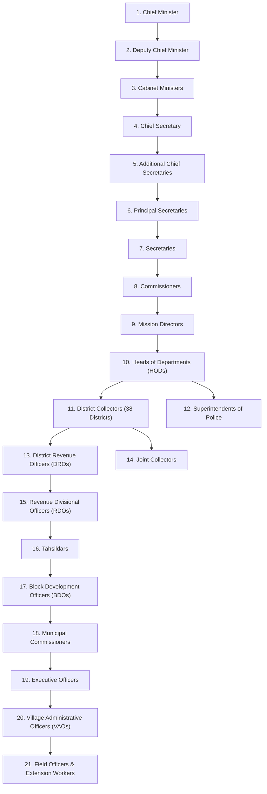

# VETTRI TN AI OS — Phase 2 Architecture Specification & Enhancement Blueprint
### Government Collaboration, Role-Specific AI Copilots & Executive Workspace

> **System:** VETTRI TN AI OS (*வெற்றி*)  
> **Phase:** 2.0.0 Enterprise Upgrade  
> **Classification:** Official Government Technology & Enterprise Architecture Specification  
> **Audience:** Chief Minister's Office (CMO), Chief Secretary, Cabinet, Department Heads, District Collectors, Field Officers  

---

## 1. Executive Summary & Architectural Evolution

Phase 2 transitions **VERTRI TN AI OS** from an executive decision dashboard into an **Omni-Role Government Operating Platform**. Every authorized government official across Tamil Nadu's 38 administrative tiers (from the Hon'ble Chief Minister down to Village Administrative Officers and Field Officers) is equipped with:
1. **Personalized Workspace & Role Cockpit** (`My Dashboard`, `My Tasks`, `My Approvals`, `My Meetings`, `My Briefings`).
2. **Dedicated Role-Aware AI Copilot** (contextualized to their role, department, district, taluk, pending files, and applicable Acts/Rules).
3. **Secure Government Collaboration & Chat** (E2EE Department, District, Project, Scheme, and Emergency communication with instant AI summarization and task derivation).
4. **Smart Government Directory & Official Hierarchy** (Integrated with TN Portal taxonomy and natural language semantic resolution).
5. **Unified Enterprise Search & Department Knowledge Hubs** (Hybrid dense-sparse vector RAG + Knowledge Graph across GOs, circulars, court rulings, budgets, and scheme records).

---

## 2. Complete Government Administrative Hierarchy & RBAC/ABAC Matrix

### 2.1 Administrative Level Taxonomy (21-Tier Structural Graph)



### 2.2 Role-Based & Attribute-Based Access Control (RBAC + ABAC)

| Role Code | Tier | Scope | Clearance Level | AI Copilot Context Window | Approval Authority Limit |
|---|---|---|---|---|---|
| `CHIEF_MINISTER` | 1 | State-wide (All Depts & Districts) | Top Secret / State Executive | Full State Knowledge Graph, Cabinet Notes, Intelligence Feeds | Unlimited (Cabinet Approval) |
| `CABINET_MINISTER` | 3 | Department Portfolio(s) + State Summary | Secret / Executive | Portfolio Data, Budget Allocations, Department Schemes, Policy Drafts | Department Budget Cap |
| `CHIEF_SECRETARY` | 4 | State Administration & Inter-Departmental | Top Secret / State Executive | Cross-Department Operations, Secretary Performance, Emergency Operations | State Administrative Sanctions |
| `DISTRICT_COLLECTOR` | 11 | District-wide (All Line Departments) | Confidential / District Executive | District GIS, Revenue, Law & Order, Relief, Beneficiary Registers | District Sanctions (< ₹50 Cr) |
| `TAHSILDAR` / `BDO` | 16-17 | Taluk / Block | Official | Land Records (Patta/Chitta), Grievances, Welfare Verification | Block Allocations (< ₹1 Cr) |
| `VAO` / `FIELD_OFFICER` | 20-21 | Village / Ward | Internal | Local Field Surveys, Beneficiary Ground Truthing, Crop Data | Inspection Submissions |

---

## 3. Dedicated Role-Specific AI Copilots

Every official interacts with a customized AI Copilot persona initialized with system instructions specific to their jurisdiction:

```
┌────────────────────────────────────────────────────────────────────────┐
│                     ROLE-SPECIFIC COPILOT ROUTER                       │
│                                                                        │
│  User Context: [Token + Role + Department + District + Taluk + Auth]   │
│                                   │                                    │
│       ┌───────────────────────────┼────────────────────────────┐       │
│       ▼                           ▼                            ▼       │
│  ┌──────────────┐          ┌──────────────┐          ┌──────────────┐  │
│  │ Chief Min    │          │ District     │          │ Field / VAO  │  │
│  │ Copilot      │          │ Collector    │          │ Copilot      │  │
│  │ State Macro  │          │ Copilot      │          │ Grassroots   │  │
│  └──────┬───────┘          └──────┬───────┘          └──────┬───────┘  │
│         │                         │                         │          │
│         └─────────────────────────┼─────────────────────────┘          │
│                                   ▼                                    │
│                    Unified Reasoning & MCP Mesh Layer                  │
│       (Postgres RLS, pgvector RAG, Knowledge Graph, Live APIS)         │
└────────────────────────────────────────────────────────────────────────┘
```

1. **Chief Minister Copilot (`cm-copilot`):** Macro-economic monitoring, ₹1 Trillion economy tracking, cabinet decision prep, crisis management, political & citizen sentiment synthesis.
2. **Finance Minister / Secretary Copilot (`finance-copilot`):** State Budget tracking, revenue leakage alerts, commercial taxes (GST), central transfers, fiscal deficit limits.
3. **Health Minister / Secretary Copilot (`health-copilot`):** Primary Health Centre (PHC) medicine stocks, epidemic outbreak predictions, Makkalai Thedi Maruthuvam scheme delivery.
4. **District Collector Copilot (`collector-copilot`):** 38 District scorecards, taluk-level grievances, flood/monsoon readiness, patta transfer backlogs, CM dashboard review prep.
5. **Police Commissioner / SP Copilot (`police-copilot`):** Law & order heatmaps, bandobast intelligence, cybercrime trends, inter-district incident correlation.
6. **VAO & Field Officer Copilot (`field-copilot`):** Land settlement disputes, local relief disbursement, beneficiary entitlement checks, crop loss assessments.

---

## 4. Secure Government Collaboration & Chat Platform

### 4.1 Chat Architectures & Hierarchy Channels
- **One-to-One Secure Channels:** Encrypted direct messaging between any verified officers in the state directory.
- **Auto-Generated Hierarchy Groups:**
  - `cabinet-executive-core`: CM, Ministers, CS.
  - `all-collectors-network`: CS, ACS Revenue, All 38 District Collectors.
  - `dept-{dept_code}-hq`: Principal Secretary, Commissioner, HODs, District Officers.
  - `district-{district_code}-disaster-response`: Collector, SP, DRO, Fire & Rescue, PWD Engineers.
  - `scheme-{scheme_code}-taskforce`: Scheme Director, participating nodal officers.

### 4.2 Embedded Intelligence & Workspace Features in Chat
- **AI Conversation Summarizer:** 1-click generation of briefing notes from 200+ message threads.
- **Action Item & Task Derivation:** Highlight text or click `"Convert to Government Task"` to automatically schedule deadlines and notify responsible officers.
- **In-Chat Approval Requests:** Inline interactive approval widgets with digital signature confirmation.
- **Instant Tamil-English Bidirectional Translation:** Real-time translation for bilingual field-to-headquarter messaging.

---

## 5. Smart Government Directory & Knowledge Graph

### 5.1 Comprehensive Officer Profile Schema
- **Identity & Structure:** Full Name, Designation, Department, Cadre (IAS/IPS/TNS), Administrative Level, Office Address, District, Taluk.
- **Responsibilities & Portfolio:** Schemes supervised, ongoing capital projects, committee memberships, reporting line (`reports_to_id`, `subordinates[]`).
- **Live State:** Real-time calendar availability, pending approval count, performance index score, direct verified official contact (Email, CUG Phone, Secure Extension).

### 5.2 Natural Language Directory Search (NL2Query + Vector)
Enables complex inquiries such as:
- *"Who is the Principal Secretary for School Education?"*
- *"Show all District Collectors handling Delta district water discharge."*
- *"Who manages Chennai Metro Phase 2 execution?"*
- *"List all Revenue Divisional Officers in Madurai district with pending land acquisition files."*

---

## 6. Executive Meeting Intelligence Workspace

```
┌────────────────────────────────────────────────────────────────────────┐
│                     EXECUTIVE MEETING WORKSPACE                        │
├────────────────────────────────────────────────────────────────────────┤
│ PRE-MEETING:                                                           │
│  • AI Agenda Generation & Participant Optimization                     │
│  • Automated Department / District Dossier Compilation                 │
│  • Historical Decision Audit & Unresolved Action Check                 │
├────────────────────────────────────────────────────────────────────────┤
│ LIVE-MEETING:                                                          │
│  • Real-time Transcription (Tamil & English speech-to-text)            │
│  • Live Fact-Checking against Government Datasets                      │
├────────────────────────────────────────────────────────────────────────┤
│ POST-MEETING:                                                          │
│  • Auto-Generated Minutes of Meeting (MoM)                             │
│  • Action Item Extraction & Automatic Escalation Timer                 │
│  • Official Government Order (GO) Draft Generation                     │
└────────────────────────────────────────────────────────────────────────┘
```

---

## 7. Unified Enterprise Search & Department Knowledge Hubs

### 7.1 Unified Search Engine (`/api/v1/search/omni`)
Search across 15+ government data silos in a single keystroke:
- **Government Orders (GOs):** MS / 4(D) / Routine Orders with full-text & semantic vector embeddings.
- **Statutes & Rules:** Tamil Nadu Acts, District Gazette notifications, Central Acts.
- **Assembly Proceedings:** Questions & Answers, Budget speeches, Legislative commitments.
- **Grievances & Files:** e-Office file summaries, CM Cell petitions, Special Grievance logs.

---

## 8. Phase 2 Implementation Roadmap & Priorities

| Milestone | Component | Description | Dependencies | Effort | Risk & Mitigation |
|---|---|---|---|---|---|
| **M2.1** | **Personalized Workspaces & Command Center** | Deploy role-tailored landing dashboards (`My Tasks`, `My Approvals`, `My Briefs`) with unified Cmd+K palette. | Phase 1 Foundation | 2 Weeks | Low — Reuses design system & auth tokens. |
| **M2.2** | **Government Hierarchy & Directory Engine** | Build 21-tier organizational graph, officer profile cards, and semantic directory search. | PostgreSQL 16 / pgvector | 2.5 Weeks | Medium — Requires comprehensive initial seed of TN administrative data. |
| **M2.3** | **Secure Collaboration & Government Chat** | Implement real-time WebSocket messaging, auto-generated role channels, and AI thread summaries. | Redis Pub/Sub, WebSockets | 3 Weeks | Medium — Mitigated by strict E2EE & RBAC channel ACLs. |
| **M2.4** | **Role-Specific AI Copilot Mesh** | Deploy role-parameterized LangGraph copilot agents for CM, Ministers, Collectors, and Field Officers. | LangGraph + MCP Tool Mesh | 3 Weeks | High — Mitigated by strict hallucination guardrails & citation enforcement. |
| **M2.5** | **Executive Meeting Intelligence Workspace** | Build meeting scheduler, automatic pre-briefing generation, live transcription, and actionable MoM extractor. | MinIO S3, Speech & LLM APIs | 2 Weeks | Medium — Async background workers handle heavy processing. |
| **M2.6** | **Enterprise Knowledge Hub & Omni Search** | Multi-department document repositories, hybrid dense-sparse RAG, and cross-statute reasoning. | pgvector HNSW + tsvector | 2.5 Weeks | Medium — Document chunking tuned for government legal formats. |
